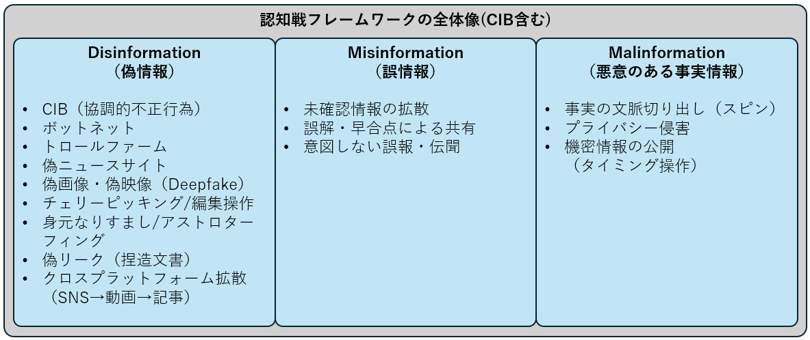

<!-- _class: title-->
# 認知戦とレジリエンスの基礎

2025-08-11
hogehuga
脆弱性対応研究会

---

# 目次

近年注目を集める「認知戦」についての概要を理解するための資料です。

1. 認知戦の概要と目的
2. 認知戦のメカニズムと具体的な手口
3. 認知戦への対抗戦略
4. レジリエンス獲得のための具体的な行動指標
5. まとめ

---

<!-- _class: paragraph -->
# 1.認知戦の目的

---

# 1.1. 定義

認知戦（Cognitive Warfare）とは、人々や組織の**認知・判断・行動**に影響を与えることを狙った作戦・活動の総称です。サイバー攻撃や宣伝だけではなく、SNS運用、ディープフェイク、法律・世論工作などを**組み合わせて**「頭の中（認知）」を戦場にします。

---

# 1.2. 目的

認知戦を行う主な目的は以下の通りで、我に有利になるように働きかけます。

- 国益の推進
  - 自国の政策・正当性を有利に見せる
- 対象国力の低下
  - 社会の信用基盤（政府・選挙・メディア・科家具）への不信を育て、内部対立を深める
- 世論の乗っ取り、議論のすり替え
  - 情報公の洪水や分断言説で公共議題を占領し、政策決定をゆがめる
- 意思決定の操作
  - 相手に「望ましい決断」を自発的に選ばせる

---

我（自分、個人、集団、国家、など）が有利になるように、相手の認知をゆがませる活動です。

---

<!-- _class: paragraph -->
# 2. 認知戦のメカニズムと手口

---

# 2.1. 具体的な手口

認知戦で使われる手口について、ここでは網羅的に6個ほど列挙します。

---

# 2.1.a. 物語操作（Narative Ops）

- 偽情報の流布（Misinformation/Malinformation）
  - 虚偽や改ざん画像・動画・記事の拡散する
- 分断工作（Subversion）
  - アイデンティティや価値観の対立を煽る
- 反射制御（Reflexive Control）
  - 相手の信念や情報フィルタを読んで「望む結論」に誘導する

---

# 2.1.b. 技術的増幅と偽装

SNSなどネットで利用される方法です。

- 協調的不正行為（CIB）
  - ボット・捨てアカウント・偽ページをネットワーク運用して"人気"や"地元発信"を偽装し、議論を操作
- マイクロターゲティング広告
  - アルゴリズムの"炎上優遇"を利用した拡散最適化

---

# 2.1.c. 合成メディア

- 偽映像・音声で指導者の"降伏宣言"を捏造し、ハッキング下放送枠やSNSで拡散する
  - ウクライナのぜれんすきー偽動画などが該当する

---

# 2.1.d. サイバー作戦と組み合わせ（Hack&）

- 侵入　→　搾取　→　選別流出　→　宣伝、の合わせ技
  - 2016年の米選挙の米司法省起訴状、2017年仏大統領選"MacronLeaks"など該当する

---

# 2.1.e. 組織的フロント/統一戦線型活動

- 文化・経済・地域団体を介した影響獲得や、"第三者の顔"での働きかけをする
  - 台湾をめぐる動向の報道・分析に多数の事例が示されている

---

# 2.1.f. 法的戦・言論空間の規範争い

- 三戦（世論・心理・法律）アプローチ
  - 中国の影響工作開設に頻出している

---

<!-- _class: paragraph -->
# 3. 認知戦への対応

認知戦への対抗策

---

# 3.1. 攻撃の前（予防・備え）

- a. Prebunking（予防接種）
  - ワクチンのように**弱い攻撃法**を先に学ぶことで、後の詐術に強くなる。大規模フィールド実験（YouTube広告の90秒動画など）で有効性を確認できている。
- b. Debunking（事後訂正）
  - すでに広まった誤情報に対して、**正確な情報と理由**を提示し、受け手の理解の"穴"を埋めて誤りを**置き換える**作業
- c. メディア・情報リテラシーの習慣化
  - SIFT（Stop/Investigate/Find/Trace）や横読み（Lateral reading）で「**まず止まる→出所をあたる**」

---

- d. 早期警戒・ソーシャルリスニング
  - 世論・検索・SNSの初期兆候を継続監視し、**虚偽の芽**を特定
    - WHOのInfodemic運用やEARSが該当
- e. 生成AI時代の真正性（Authenticity）確保
  - C2PA/Content Credentialsで、**由来と編集履歴**を改ざん耐性のある形で付与
  - ウォーターマークは回避・劣化が可能、**万能ではない**
  - AIリスク管理フレームワーク（NIST AI RMF）などで社内ガバナンス整備
- f. 組織の対処体制（政府・企業）
  - リスク評価→早期警戒→影響分析→戦略広報→効果測定　という標準プロセスを利用
    - RESIST2（英政府GCS）やカナダの官公庁向け手引きに記載

---

- g. 法・制度・プラットフォーム
  - EU DSA(Digital Services Act)：
    - 巨大プラットフォームにリスク評価・軽減義務
  - 日本の検討状況：
    - 総務省がディープフェイク規制・民主的プロセスの保護の国際動向を整理
  - プラットフォーム側：
    - 協調的不正行為の定義と撲滅を明文化

---

| 手口 |  例  | 手先 | 事前 |
| :--- | :--- | :--- | :--- |
|情報洗浄（段階的正当化）|偽クローンサイト＋SNSリプライ爆撃|ソーシャルリスニング/インフルエンサー教育|追跡公表・ドメイン差押え・訂正拡散|
|ディープフェイク|指導者の降伏偽動画|C2PA普及・識別教育|迅速な本人発信＋プラットフォーム連携テイクダウン|
|CIBネットワーク|ボット・捨てアカウント連携|行動特徴モデル構築|アカウント一括停止・広告制限・レポート公開|
|ハック＆リーク|窃取文書の選別流出|ゼロトラスト/DLP/危機広報訓練|フォレンジック・出所説明・メディア同行取材|

※CIB：Coordinated Inauthentic Behavior
- Coordinated（協調的）
- Inauthentic（不正/偽りの）
- Behavior（行動）

---

---

# 3.2. 攻撃の後（発生時・回復）

- a. 迅速で透明な「一本化メッセージ」
  - 誤りを端的に提示→正確な情報→再度誤りをリマインド　する「サンドイッチ訂正」を推奨
- b. テイクダウン／減衰政策（De-amplification）
  - CIBネットワークや偽装サイトの摘発・制裁・ドメイン差し押さえ
- c. 共同訂正の動員
  - ファクトチェックとコミュニティ参加型の訂正を併用
- d. 事後レビュー（Lessons Learned）
  - 侵入経路（技術・人的・制度）と拡散経路（メディア生態系）を後方視的に可視化し、Prebunking教材へ再利用

---
<!-- _class: paragraph -->
# 4. レジリエンス獲得のための具体的な行動指標

---

# 4.1. 一般市民（個人）

- SIFTを習慣化
  - 怪しい投稿は、一拍置く（STOP）→発信者を調べる（Investigate）→より良い情報源を探す(Find better coverage)→一次情報をたどる(Trace)
- 手口を学習する
- 画像・動画の真正性をチェックする
  - 画像検索などで確認し、強い感情がわいたら一旦停止をルール化
- ファクトチェック窓口の活用
- プライバシーと"共有前の3秒"
  - 自分の怒り・不安を狙うのが作戦、共有前に3秒カウントをルール化

---

# 4.2. 国家・政府（中央・自治体）

- 常設の"認知危機対処チーム"をつくる
  - 早期警戒→状況洞察→影響評価→戦略広報→効果追跡、を平時から運用
- 法・制度の整備と国際連携
- 教育・公共コミュニケーション
  - 学校教育への、SIFT/横読み/合成メディア識別の統合
  - ルーマーコントロール（噂対処）の単一の正確な情報源を提示
- 政府メディアの真正性強化
  - C2PAのContent Credentialsを政府写真・動画・告知物へ適用
- 事例公開と抑止
  - ハック&リークやCIB摘発の即時公表・制裁（ドメイン差押え、制裁指定）

---

# 4.3. 民間企業（プラットフォーム、一般企業）

- MDMインシデント対応計画を、CSIRT/広報と統合
  - 検知→検証→エスカレーション→対外説明→是正　の手順を作成
  - Debunking Handbook準拠の訂正テンプレートを用意
- コンテンツ真正性と透明性
  - 自社制作物にContent Credentialsを付与
  - 生成AIの開示方針、改変ログ管理、合成音声の同意・台本保全
- AIガバナンス
  - NIST AI RMFでモデル運用リスクを査定
- プラットフォーム・広告の健全化
  - 協調的不正行為（CIB）の社内定義と検出強化と、透明性レポート

---
<!-- _class: paragraph -->
# 5. まとめ

---
# まとめ

- 認知戦は **「人の判断」を巡る競争** であり、**物語x技術x制度** の複合戦
- もっとも費用対効果が高いのは、事前の備え（Prebunking+教育+真正性）で、発生時は 速さ・一貫性・透明性 が決定的
- 技術は必要要件であり、水際の人間的判断習慣（SIFT）と制度的責任（DSAの義務）が併せて効果的

---

<!-- _class: paragraph -->
# 補足情報

---

EU DSA
- EUのDigital Services Act
  - https://commission.europa.eu/strategy-and-policy/priorities-2019-2024/europe-fit-digital-age/digital-services-act_en
  - https://www.soumu.go.jp/main_content/000932295.pdf
- 2022年に採択し、2024年02月に全面適用された、オンラインサービス提供者に対する包括的な規則
- 違法・有害コンテンツや広告の透明性、ディスインフォメーション対策を含む適切かつ責任あるコンテンツ管理を義務化する

---

C2PA
- Coalition for Content Provenance and Authenticity
  - https://c2pa.org/
- デジタルコンテンツの出所（プロべナンス）や改変履歴を標準化して記録・検証するための国際的な技術仕様 を策定している業界団体、およびその使用の総称
- 改ざん困難な形でメタデータとして埋め込み、検証できるようにする
  - 課題としては、普及率依存、アップロードや再保存時のメタデータ削除、プライバシー悪用懸念、悪意のある発行者、等がある