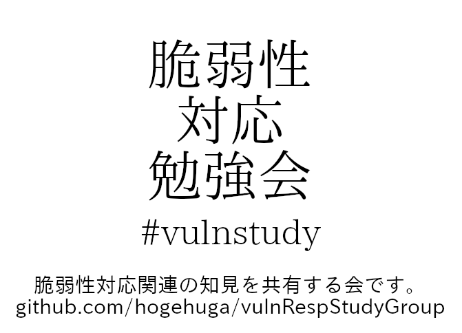
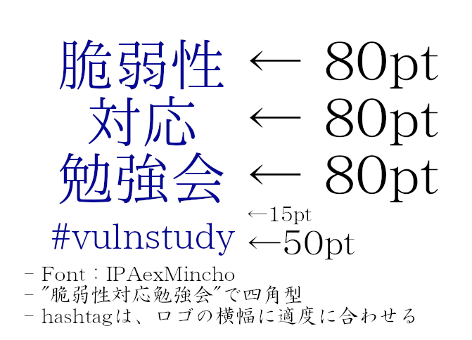

# ロゴについて

脆弱性対応勉強会/研究会 のロゴについて定義します。

## 構成

以下のように定義しています。

- フォント
  - IPAexMincho
- 構成
  - ベース
    - 「脆弱性」「対応」「勉強会」(若しくは研究会)の3行構成で、四角をイメージする
    - 現時点では色については指定しない
      - 今後、R:G:B=10:10:150 の色を使用する可能性あり
  - 2パターン
    - 「脆弱性対応勉強会」「脆弱性対応研究会」で3行
      - `脆弱性\n対応\n勉強会` の改行区切りとする
    - 上記構成 + 「#vulnstudy」
      - 標準的な文字サイズ割合は以下の通り
      - 「脆弱性\n対応\n勉強会」は、80pt
      - 上記下に空改行を、15pt
      - 上記下に「#vulnstudy」は、50pt
        - 参考として、gimpのファイルを vulnstudy-logo.xcf として配置

## 構成例

下画像を参照

- 
- 