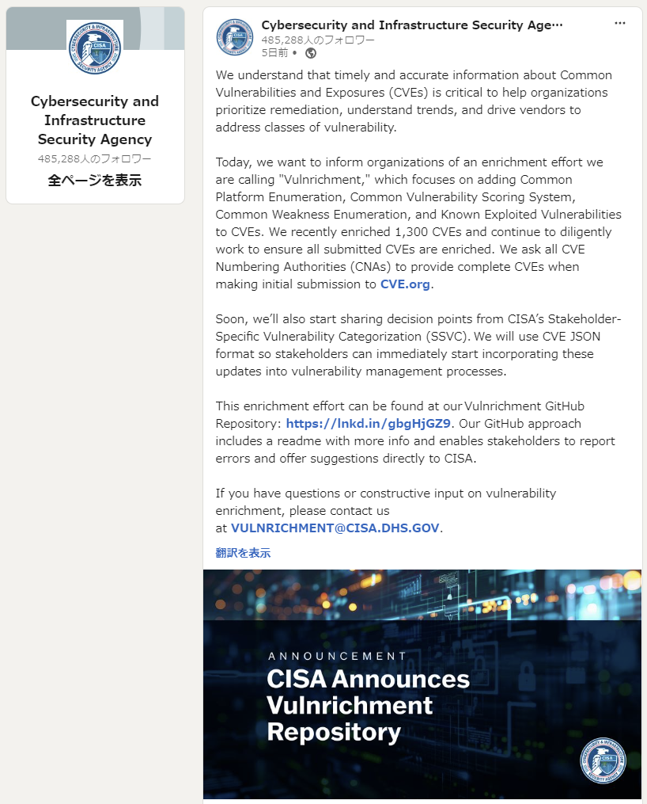
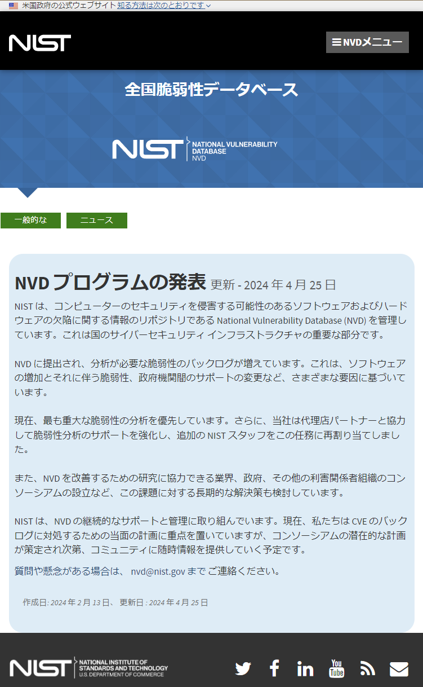
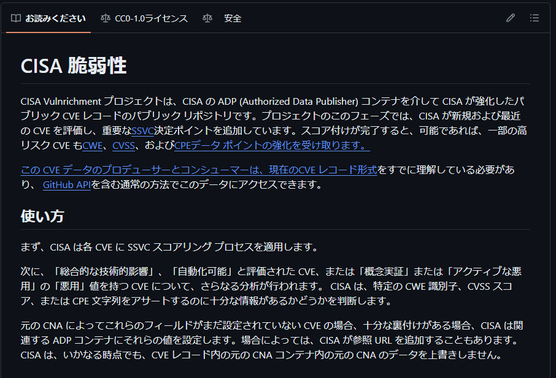
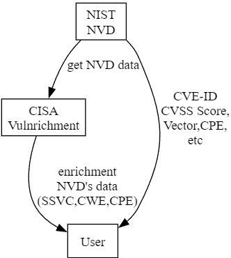
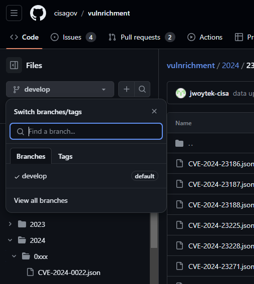
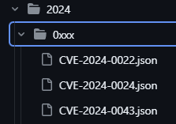
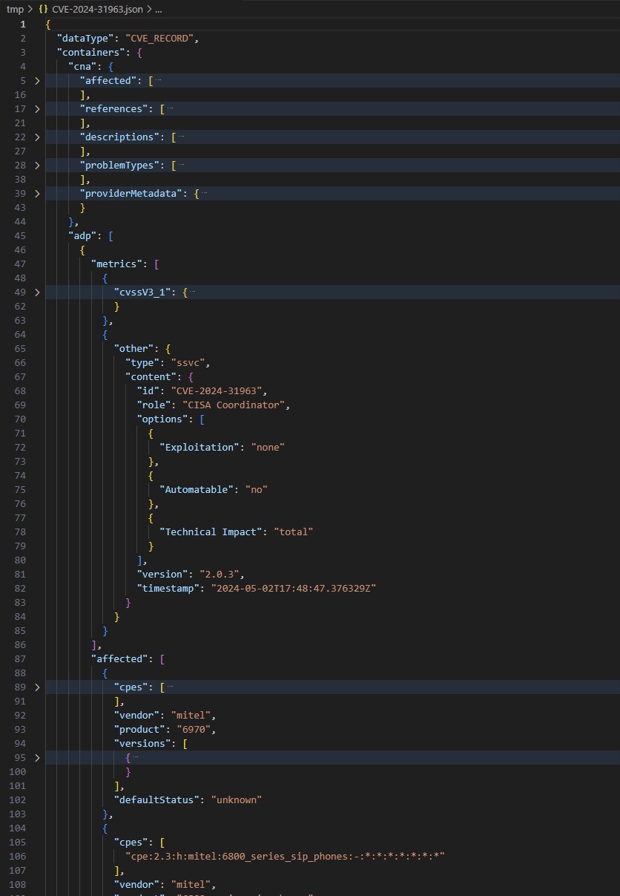
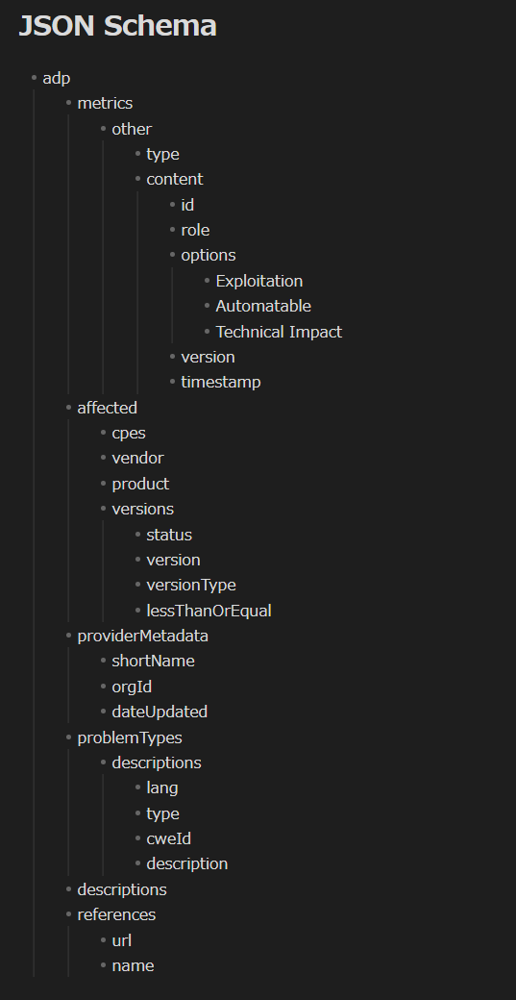
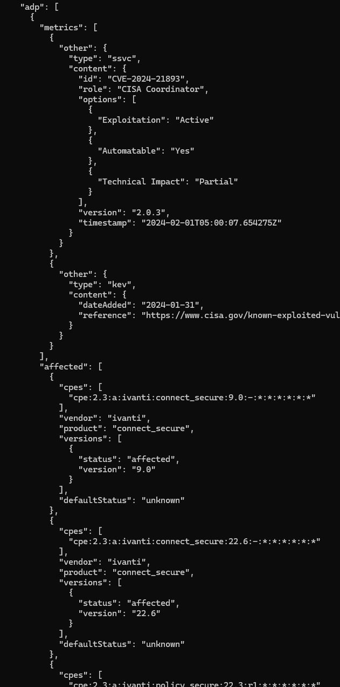
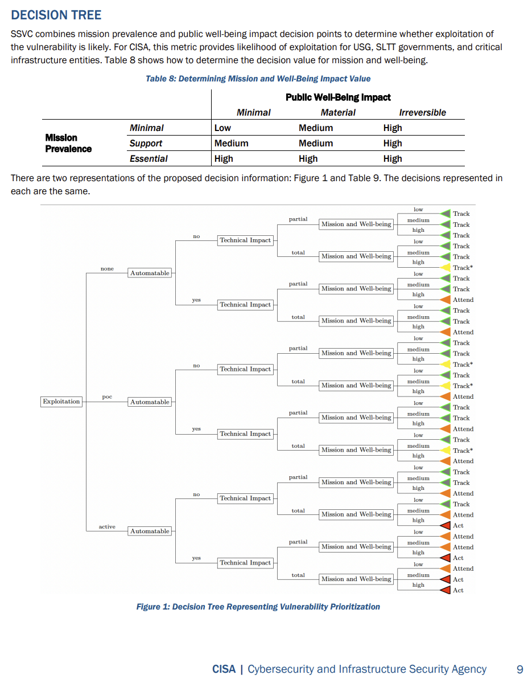

<!-- _class: title-->

# Vulnrichmentとは何なのか

2024-05-14
hogehuga
脆弱性対応勉強会

---

# 概要

米国土安全保障省サイバーセキュリティ・インフラストラクチャセキュリティ庁（CISA）が、2024-05-09（現地時間）に発表した ***Vulnrichment** プロジェクトについて、概要と実際に触ってみた感想と今後の想定される展望をまとめます。

- Vulnrichmentとは
- 現状のデータ
- 今後の展望

---

# 諸注意

まだ公開されたばかりのプロジェクトであるため、短期間で状況が変わる可能性があります。

- githubのreadmeに「このプロジェクトは今後数週間で急速に進化すると予想されますので、」とある通り、この資料作成段階とは状況が変わる可能性があります。
  - https://github.com/cisagov/vulnrichment
    - `This project is expected to evolve quickly over the next several weeks, so please keep an eye on this README.md.`
- 本資料作成者である私は、特にこのプロジェクトに関連はしていないため、公開された情報からのみ得られた情報で記載をしています。
- 本資料について、私の所属組織等とは一切関係のない個人の活動であり、所属する組織等の意見をとは異なる場合があります。
- 2024-05-14のデータ/情報を基にしています。

---

<!-- _class: paragraph -->

Vulnrichmentとは

---
# Vulnrichmentプロジェクトとは

米国国立標準技術研究所（NIST）が運営する脆弱性データベース"National Vulnerability Database（NVD）"の更新等の停滞に伴う問題解決のために立ち上げたプロジェクトです。

- NVDは更新遅延が発生しています。
  - `NVD に提出され、分析が必要な脆弱性のバックログが増えています。これは、ソフトウェアの増加とそれに伴う脆弱性、政府機関間のサポートの変更など、さまざまな要因に基づいています。`
  - `現在、最も重大な脆弱性の分析を優先しています。さらに、当社は代理店パートナーと協力して脆弱性分析のサポートを強化し、追加の NIST スタッフをこの任務に再割り当てしました。`
  - `また、NVD を改善するための研究に協力できる業界、政府、その他の利害関係者組織のコンソーシアムの設立など、この課題に対する長期的な解決策も検討しています。`

---

# .

- 近年、脆弱性情報に付加する情報が増えています。
  - KEV Catalog/EPSS/SSVCでの判断情報 等をNVDの基本的な情報に付与して利用することが多いはずです。
  - NVDの更新遅延を見る限り、人員や予算的にもNVDがそれらの情報付加（enrichment）をするのは難しいようです。
- 上記の付加情報をNVD以外の組織が用意すべく、CISAが Vulnrichment プロジェクトを立ち上げたようです。
  - CISAがNVD CVEレコードを強化するイメージです。
    - SSVCのdecision pointの情報を付与する（automatable, ）
    - 可能であれば一部の高リスクCVEの、CVE/CWE/CVSS/CPE の付与/強化を行うようです。

---

# まとめると

- NVD Schema
  - https://csrc.nist.gov/schema/nvd/api/2.0/external/cvss-v3.1.json
    - CVE-ID, CPE, Reference, 
    - CVSS Vecotr, CVSS Score, Severity
    - etc
- Vulnrichment Schma
  - **NONE!!** , but..
    - SSVC Decision point, CWE, (enrichment)CPE

---

<!-- _class: paragraph -->

現状のデータ

---

# Vulnrichmentを使う

一度ローカルにデータを落としましょう

1. `https://github.com/cisagov/vulnrichment` を `git clone` します
2. 直接jsonを見てみましょう（えぇ、、、）

データ的には、以下の階層構造になっています。

- YYYY（年：CVE-IDの先頭）
  - CVE-IDの2項目目（YYYY-xxxx-NNNNのxxxx部分）
    - CVE-ID.json

データ配置的には、NVDのgithubと同じで、NVDのような検索用のAPIサイトとかは特になさそうです。

あと、branch名が `develop` なので、実利用するのはもう少し待ちましょう。

---
# json

jsonを見てみましょう

- cnaの情報は `.containers.cna` に記載
- 今回追加されるものは `.containers.adp` 以下のようです。
  - `.metrics` で、CISAで更新したMetricsが記載されているみたい
  - `.other` に、SSVCの情報が書かれていました
  - `.affected` に、CISAでenrichmentされたCPEが記載されていました

スキーマが公開されていないので、今のところどこにどのデータが入るのかはよくわかりません。

---

# json 

現在登録されているデータから、おおよそ左側のような構成になっていることを確認しました。
- `.metricsr`
  - enrichmentされたCVSS
  - SSVCの情報
    - role（DecisionTree）/Exploitation/Automatable/Technical Impact
  - KEV Catalog登録情報
- `.affected`
  - enrichmentされたCPE
- `metrics.`
- `.problemTypes`
  - CWE-ID等

---

# データ例

CVE-2024-21893: Ivanti Connect Secure, Policy Secure, and Neurons Server-Side Request Forgery(SSRF) Vulnerability
(./2024/21xxx/CVE-2024-21893.json)

- SSVC
  - CISA Coordinator
    - Exploitation: Active
    - Automatable: Yes
    - Technical Impact: Partial
- KEC
  - dateAdded: 2024-01-31
- CPES
  - 大量に記載あり
- CWE
  - CWE-918 Server-Side Request Forgery (SSRF)

---

# (補足)

SSVCの値は、ユーザ環境にあたるデータさえあれば、トリアージができる状態になる。

- **Exploitation** (vulnrichmentで提供)：（none|poc|active）
  - 脆弱性の積極的な悪用の証拠の有無
- **Automatable** (vulnrichmentで提供)：（no|yes）
  - 悪用の自動化ができるか
- **Technical Impact** (vulnrichmentで提供)：（partial|total）
  - 脆弱性悪用による、技術的影響範囲
- **Mission & Well-Being** (非提供)：（low|medium|high）
  - Mission Prevalence: 組織の事業継続への影響
  - Public Well-Being Impact: 人に及ぼす影響
    - 対象とするシステムや環境次第でるため、SSVC利用者が決定する必要がある

---

<!-- _class: paragraph -->

まとめ

---

# まとめと所感

まだ一般運用者が使えるデータではないので、研究者以外は手を出さなくてよさそうです。
とはいえ、今後、プロジェクトとして稼働してきたら、結構いい情報源にな源になりそうですね。

- Negative
  - Schemaが不明(どこにどの項目がどのように入るのか不明)
    - Schemaが固まるまでに、難度か変更がある気がする
  - データが安定していない(大文字小文字問題：Yes/yesなど)
  - データとして扱うには、説明文字が多すぎる(CWE-IDだけではなく、CWE自体のDescriptionまである)
  - データ量が少ない(2024-05-14時点で2445件)
- Positive
  - SSVCの(Exploitation|Automatable|Technical Impact)があるのは良い
    - SSVCの普及に貢献する
  - とりあえずVulnrichmentを見て、無ければNVDを見る、ような運用ができる
  - NIST NVDの負荷が減ることで、停滞が解消される（？）