<!-- _class: title-->

# 非公式 脆弱性トリアージ ガイドライン作成の 手引きの概要説明

hogehuga
脆弱性対応勉強会

---

# 概要

JNSA WG1及び脆弱性診断士スキルマッププロジェクト として、「脆弱性トリアージガイドライン作成の手引き」がリリースされました。
- https://github.com/WebAppPentestGuidelines/TriageGuidelines/tree/main

現段階(2024-05-26 JST)では第1章までのリリースとなっています。
- 今回のリリース
  - 第1章: 対応の基本方針策定についての説明
- 今後リリース予定
  - 第2章: 高度な専門知識をもった人がリスク判定の精度を上げるための手法の説明
  - 第3章: 詳細な判断に利用できそうなフレームワークの紹介

本テキストでは、本プロジェクト自体の紹介ではなく、**手引きの中身についての解説**を試みます。

---

<!-- _backgroundColor: orange -->

# attention

- 本解説について、筆者(hogehuga)個人的な感想であり、当該グループと思惑が異なる場合があります。
- また、筆者が所属している組織と見解が異なる場合があり、無関係です。
- 人により解釈が異なる場合があり、参考情報として閲覧ください。

---

<!-- _class: paragraph -->

はじめに

---
# summary

## 本ドキュメントの目的
`「組織が脆弱性に適切に対応することを目的として、脆弱性診断を実施した際に提供された報告書に記載された脆弱性対応の優先順位付け（トリアージ）を行うために、その組織に適したトリアージガイドラインを作成するための手引き」`

## トリアージをするために
- 適切なトリアージを行うためには明確な判断基準が必要
- 脆弱性の取扱はあなた自身で判断する必要がある
- トリアージの必要性と、脆弱性対応判断のフロー

## トリアージガイドライン作成のためのフロー
- 最低限のトリアージ体制を作る
- トリアージ精度を向上させる

---
# 前文

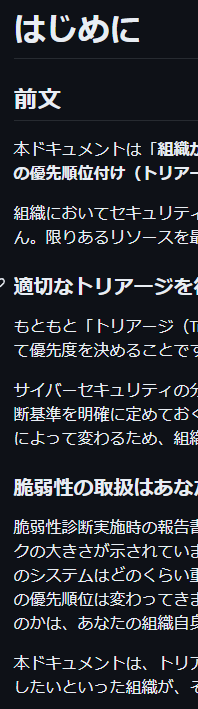

`組織に適したトリアージガイドラインを作成するための手引き` です。

- 発見されたすべての脆弱性に対応できるとは限らないため、`適切に優先順位をつけて対応`していくことになります。
- `適切に優先順位をつけて対応` とはどのようなものか、例示を交えて解説しています。
- あくまで **例示** であるため、自組織に合うように自分たちで変更すべきものです。
  - 変更するために **どのように考えるのか** を示しているので、本書はガイドラインなのです。

`本ドキュメントは、トリアージについてこれから取り組むという組織や、ある程度取り組んでいるが自社に明確なガイドラインがない、見直したいといった組織が、その組織に適したトリアージガイドラインを作成して頂くことを目的としています。`

- まずは本書を参考にして脆弱性トリアージをはじめて、運用しながら合わない部分を変更していく、という使い方が良いと考えます。

---

# .

トリアージガイドラインを作成するには、以下の2項目について意識する必要があります。
- 明確な判断基準が必要
- 脆弱性の取り扱いは **あなた自身で** 判断する必要がある

## 明確な判断基準

誰がトリアージを行っても一定の判断ができることが必要で、そのために明確な判断基準を設ける必要があります。緊急時や"トリアージ担当者不在"の際にも対応ができますし、もし結果的に判断が間違っていた場合に「なぜその判断になったのか」を示すことができます(原因を、人の判断揺れではなく、ポリシーにできる)。
また、経営層等の上位者への報告コストも抑えられると考えられます。

## 脆弱性の取り扱いはあなた自身で判断する必要がある

脆弱性診断や脆弱性情報では、**脆弱性それ自体の危険度**しか伝えることはできません。なぜならば、運用されている環境はユーザの数だけあり、それはほぼすべて異なるためです。
その為、自分の環境においてどう判断するか等は、自分自身で決定する必要があります。

---

# なぜ脆弱性のトリアージが必要なのか

顕在化した脆弱性すべてに対応できるのが理想ですが、対応に必要なリソースは無限ではないため、「優先度をつけて、影響が重大なものを優先的に対応する」事になります。**対応優先度をつける**という行為を**脆弱性のトリアージ**と呼んでいます。
- 影響が大きいものは、早く対応する
- 影響が**許容できる**場合は、優先度を下げ、より影響の大きいものに対応する方が合理的

あくまで**対応優先度**であり、**対応しなくても良い**とは区別して考えることが望ましいです。
- 後回しにしただけなので、後でやりましょう
  - 単体では影響は少ないが、組み合わせることで多大な影響を及ぼす脆弱性などもあります。
  - 緊急メンテナンス、定期メンテナンス、等の対応時間差で考えるとよいはずです。

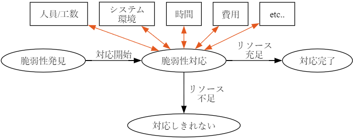 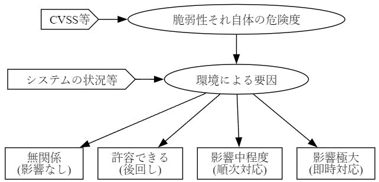

---

# 脆弱性対応の判断フロー

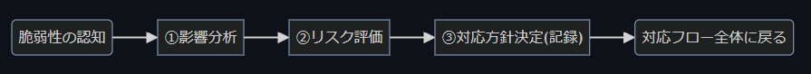

脆弱性トリアージの一般的なフローとしては、以下のアクションを行います。

- ①実際に脆弱性の影響を受けるのか、その範囲はどの程度なのかを分析
  - 利用環境等に依存するため、同じ脆弱性でも組織により影響は異なります
- ②脆弱性の危険度や対象の重要度などからリスクを評価
  - 同じ影響でも、対象の重要度（保有情報の価値など）で評価は変わります
- ③対象の脆弱性の対応方針を決定
  - トリアージとしての対応方針を決定しますが、その他要因により最終的には異なる優先度となる可能性もあります
  - どのように判断や対応をしたのか、等を記録することで抜け漏れを防ぐだけではなく、インシデント発生時などでのエビデンスとしても使えます

これらの考え方について、第1章で示されます。

---

# トリアージガイドライン運用のためのフロー

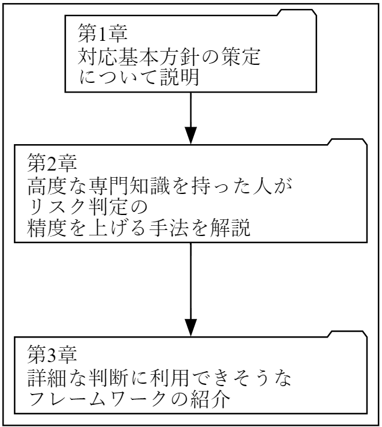
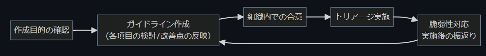

これから自組織の脆弱性トリアージガイドラインを作成される方へ、以下を推奨しています
- まずは第1章を参考としてガイドラインを作成する
- 最低限のトリアージを迅速に行える体制を作る
- 運用する -- ガイドラインを見直して運用する を繰り返す

まずは以下を達成することを目的とします。
- 高い専門知識を持っていない人でも判断できる程度の基準
- 迅速に優先順位付けができるようになる
- 優先度について関係者全体の意識をある程度揃える
  
慣れてきたら、第2章以降を活用しましょう。

---

<!-- _class: paragraph -->

第1章 トリアージガイドラインの作成

---

# 1.0. 本章の目的

基本対応方針を策せ呈することにより、 **迅速に最低限のトリアージが可能な体制を構築すること** を目的としています。

そのためには以下について考慮/検討する必要があります。
1. 関係者の役割と責任を明確にする
2. トリアージガイドラインの適用範囲の決定
3. 脆弱性の影響範囲の調査
4. トリアージで決めるべきこと
5. 脆弱性の管理方法の決定

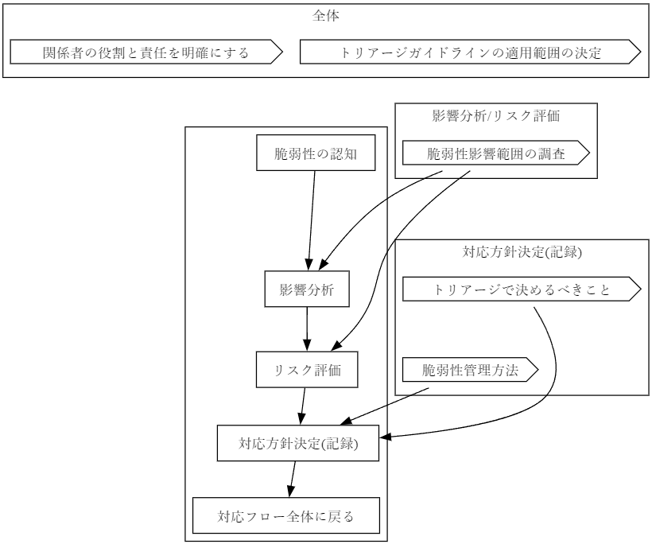

---

# 1.1. 関係者の役割と責任を明確にする

脆弱性対応をするにあたり、様々に人物やチームが関与します。
その為、各関係者の **役割と責任範囲** を明確にすることが必要です。
- 関係者の例
  - CISO
    - すべてのシステムにおいて、リスク管理の責任を負う立場
  - セキュリティ統括室
    - 発覚した脆弱性や対応状況について、管理監督する責任を負う
  - システム管理責任者
    - 対象システムの管理業務推進と維持管理に必要な実務全般の、判断および承認の責任を負う
  - システム管理担当者
    - システム管理責任者の指示のもと、管理業務の推進と維持管理の実務を担当

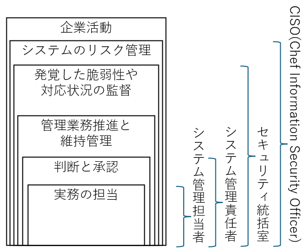

---

# 1.2. トリアージガイドラインの適用範囲の決定

策定するトリアージガイドラインを、どの範囲のシステムに提供するかを決める必要があります。
- システムの重要度によって、トリアージ基準が異なる場合があるためです。

一般的には、適用範囲は以下のように考えてよいと思われます。
- 会社全体
  - ガバナンス/組織のセキュリティポリシー として、経営層やCISOらで決定
    - 全社としてのポリシーであるため、システム個別/詳細には踏み込まないことが多い
- 部門/システムごと
  - 組織のセキュリティポリシーに合致するよう、個別にポリシーを決定する
    - システムの価値(保有情報)やシステム障害による影響などにより、システムごとに対応定義が異なる場合がある

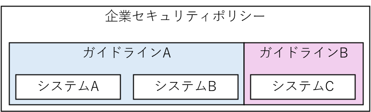

---

# 1.3. 脆弱性影響範囲の調査

脆弱性情報の収集や具体的な対応等の理解には、セキュリティに関する専門知識が必要なります。また、情報を収集する際にも、範囲や速報性を考慮しないと、相応のコストが掛かります。

第1章の段階では、まずは以下を参考とするのが良いでしょう。
- [JPCERT/CC](https://www.jpcert.or.jp/)
  - `注意喚起`や`Weekly Report`を活用しましょう
- [JNV](https://jvn.jp/)

また、**脆弱性診断**を用いるのも非常に有効です。
診断対象や範囲は、は診断事業者と発注者間で決める必要があります。診断後、類似の脆弱性が診断対象外にも存在しないか、確認する必要はあります。
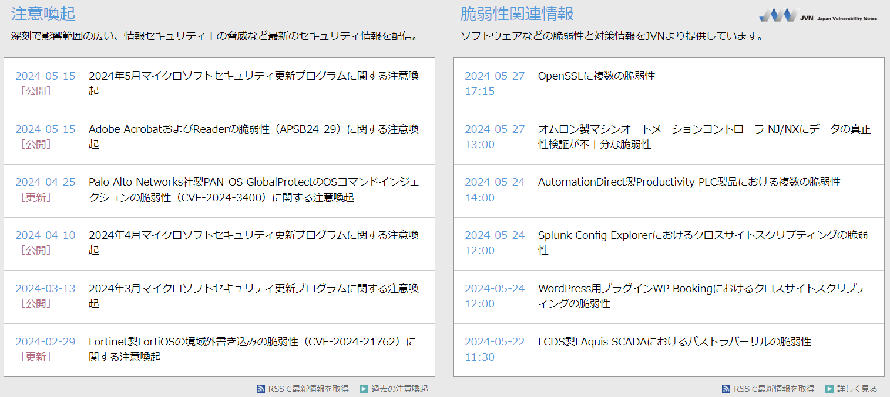
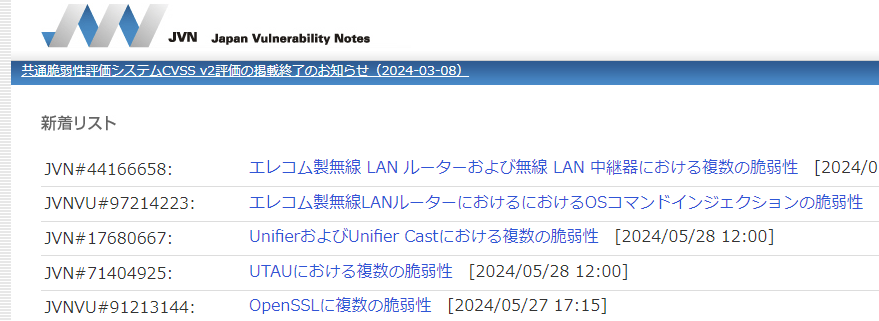

---

# 1.4. トリアージで決めるべきこと

統一的なトリアージの対応基準を設定することが重要です。
一般的には、以下の指標で対応優先度を決定します。
- 対応優先度 = 対象資産の重要度 x 脆弱性の危険度

資料中では、`対象資産の重要度 = "対象の重要度評価"項目`及び`脆弱性の危険度 = "脆弱性の危険度評価"項目`で説明がされています。

---

# 1.4.a. 対象の重要度評価
対象の重要度は、侵害された場合のビジネスインパクトに基づいて評価するのが良いでしょう。

- 資産の種類に基づく分類
  - 重要度 高：金融データ、顧客情報、特許性を有する製品や技術情報
  - 重要度 中：業務データ、従業員の勤怠情報
  - 重要度 低：ホームページ等で既に公開されている情報
- 影響度の規模に基づく分類
  - 重要度 高：利用者数1万人以上
  - 重要度 中：利用者数1000人以上
  - 重要度 低：利用者数1000人未満
- 利用者層に基づく分類
  - 重要度 高：官公庁利用（政府調達等）
  - 重要度 中：技術者、システム管理者、企業の担当者
  - 重要度 低：一般の利用者（BtoCサービス等）

---

# 1.4.b. 脆弱性の危険度評価
見つかった脆弱性について、評価します。
第1章の段階ではCVSS基本評価値(BaseScore)のみを参考にしても良いでしょう。
- 評価方針の決定
  - 脆弱性危険度評価のために、CVSS BaseScoreもしくは脆弱性診断事業者が提供する危険度評価を用います
  - 慣れてきたら、Vector値(攻撃元区分など)を重視した評価としても良いでしょう
- 危険度評価の定義例
  - CVSSでは4段階のSeverityで評価されていますが、最初は3段階で実施してい事も良いでしょう
    - CVSS Severity; Critical(緊緊急), High(高), Medium(中), Low(低) 
    - 3段階であれば、低(0.0-3.9)/中(4.0-6.9)高(7.0-10.0)

CVSSのみで評価すると現実との乖離がある可能性はありますが、専門知識がない組織でも判断ができるという利点はあります。
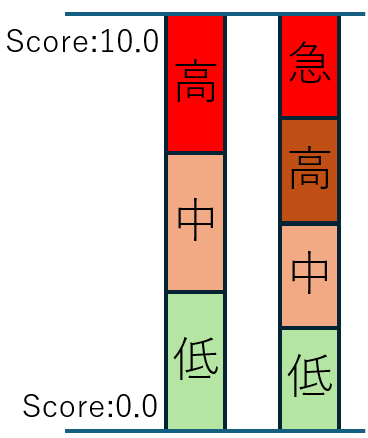

---

# 1.4.c. 対応の優先度を決める

`対象の重要度評価`と`脆弱性の危険度評価`を基に、優先度決定表を用意します。
このマトリックスを利用して、プロジェクトにおける脆弱性対応優先度を評価します。

優先度マトリックスの例

||重要度：高|重要度：中|重要度：低|
|:------:|:------:|:------:|:------:|
|危険度：高|緊急|高|中|
|危険度：中|高|中|低|
|危険度：低|中|低|低|

- CVSS Severityの4段階を利用する際は、それに該当したマトリックスを作成する必要があります。
- システムの状況により、大半が`高`もしくは`緊急`になる場合があります。その際は、今後提供される第2章以降の手法を使うことで、現実に対応できる分類にできる可能性があります。

---

## 1.4.d. 対応要否期限を決める
(トリアージで決めるべきこと、に含まれる項目と思われる)
報告された脆弱性に対し、`対応要否`と`期限`を設定する必要があります。
先に決定した優先度を基にしたマトリックスを用意します。

優先度マトリックスによる対応要否と対応期限の例

||対応要否|対応期限|
|:--|:--|:--|
|優先度緊急|対応する|1~2営業日以内に対応|
|優先度高|対応する|1週間以内に対応|
|優先度中|対応する|3ヶ月以内に対応|
|優先度低|現状対応しない|次回のシステム更改のタイミングで対応し、現システムでは対応しない|

また、環境によっては 脆弱性危険度/資産価値/攻撃影響 の別尺度での要否判断をする必要があるかもしれません。

---

## 1.5. 脆弱性管理方法
脆弱性への対応状況を適切に管理することで、対応漏れやインシデント発生時のエビデンスとして利用ができます。所謂5w1hを満たすものになります。

記録すべき情報の例
- 脆弱性概要/名称/CVE番号(公開されている脆弱性の場合のみ)
- 対象情報
- ステータス(未対応/対応済/保留/対応しない 等) 
- 対応期限
- トリアージ結果(区分/危険度/優先度)
- 起票日
- 対応完了日/対応しないことを決めた日
- 担当者
- 対応方針(例外対応が発生する場合はその内容も含む)
- 対応の記録(対応実施日/対応実施内容(例外対応なども))

---

# 最後に
脆弱性トリアージガイドライン作成の手引き の第1章では、ひとまずの基準作りについて説明しました。
- まずは運用してみましょう
- そして、運用改善のための見直しをしましょう
  - 各マトリクスの調整、判断基準の調整、判断情報の変更、等
- 判断情報としてCVSSを使っていますが、運用をしているうちに脆弱性の知識が付けば、他のフレームワークも使えるようになります。
  - 第2章以降では、それらのフレムワークを紹介する予定です

このガイドラインに作成の手引きに関しては、以下のような使い方が良いと考えます。
- まずはやってみる
- やってみることで問題点に気づく

以上、「とりーあじガイドライン作成の手引き」に基づいた紹介でした。

---

<!-- _backgroundColor: orange -->
<!-- _class: paragraph -->

ここからは、脆弱性対応勉強会独自のお話です。

---

# なにこれ？

ここからは、脆弱性対応勉強会の知見を含めたお話をします。
- "トリアージガイドライン作成の手引き"作成グループとは一切関係はなく、あくまで発表者個人の思想によります。

<!--第一章-->

---
# "関係者の役割と責任を明確にする"

これについては、セキュリティ対応組織の教科書/X.1060が、あるべき姿を想像しやすいと思います。
- 組織と経営層の関係
  - 経営層内でのCISOの立ち位置
- CDC(企業のセキュリティ対応を行う組織)
  - CISOから権限を付与され、方針策定等を行う
  - SOC/CSIRT/情報システム部 等が該当
- セキュリティチーム
  - 実際の運用を行うチーム

一般的には、SOC/CSIRT/情報システム部がすべての役割を担っていることが多いと思われます。
しかしながら要求機能は異なるため、分けて考える必要があります。

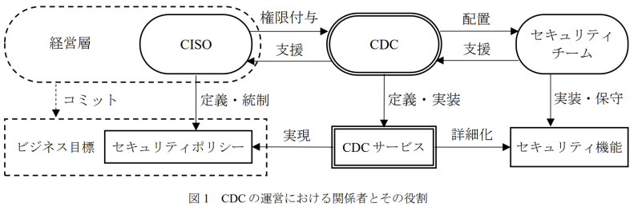

---
# .

サイバーセキュリティ経営ガイドラインだと下記のようになり複雑性が増すので、X.1060のシンプルな構成から始めるほうが良いと思われます。
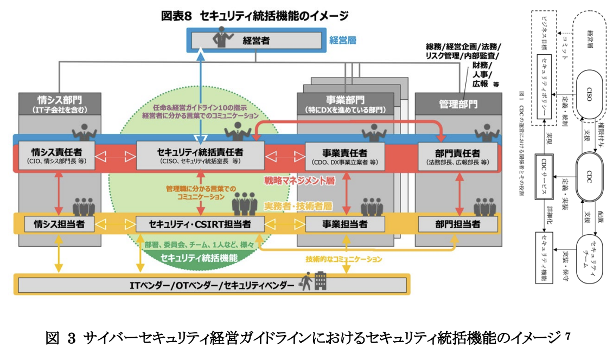

---
# .

また、セキュリティ統括機能の配置も参考例が載っているため、CDC側としては、CISOと協力して組織を再編する作業も必要になるかもしれません。

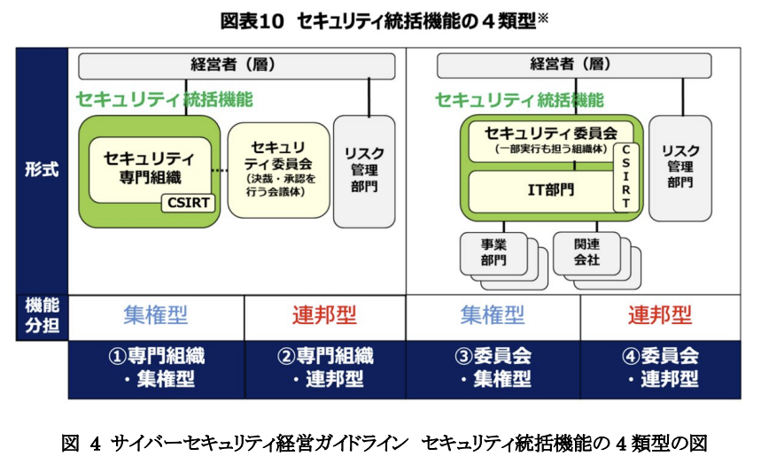 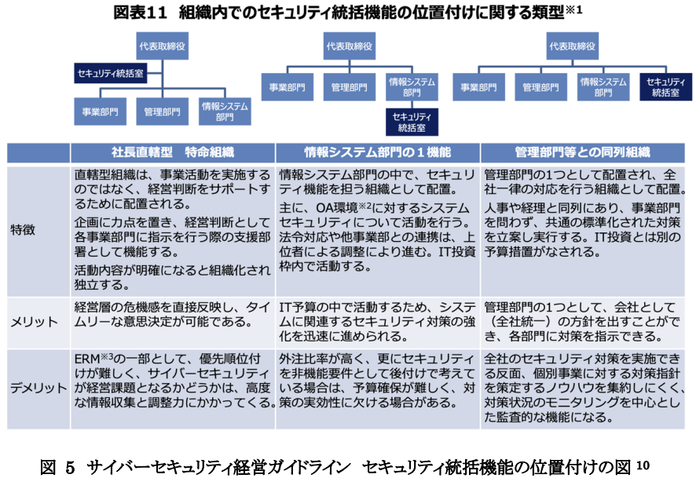

---
# "トリアージガイドラインの適用範囲の決定"

本ガイドラインは"トリアージ"に注力しているが、脆弱性管理全体像としては、おおよそ以下の通りです。
システム管理責任者/システム管理担当者 で取り扱うべき対象や粒度は、別途検討すべきと考えます。

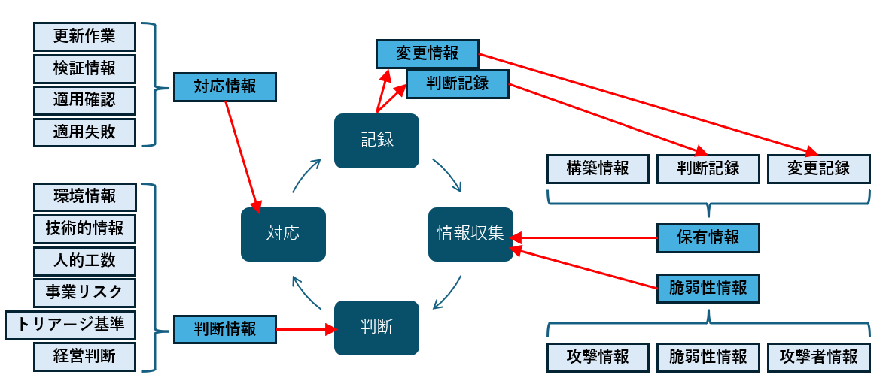

---
# ”影響範囲の調査”

適切な診断方法の選定が必要です。
- 一般的に、プラットフォーム診断とWeb診断に分かれます
  - WEB診断：WEBアプリ側の診断
    - CVE-IDが付かないことが多く、診断をしないと発見できない
  - プラットフォーム診断：ネットワーク、OSやミドルウェア層までの診断
    - ベンダからCVE-IDがつけられる

また、「自組織に影響があるか」の判定情報も必要です。
- 「対象のソフトウェア」の「該当バージョン」を利用しているかの判断が必要
  - 故に、SBOMが重宝されようとしている
  - ソフトウェア一覧は、最新の状態を維持する必要がある

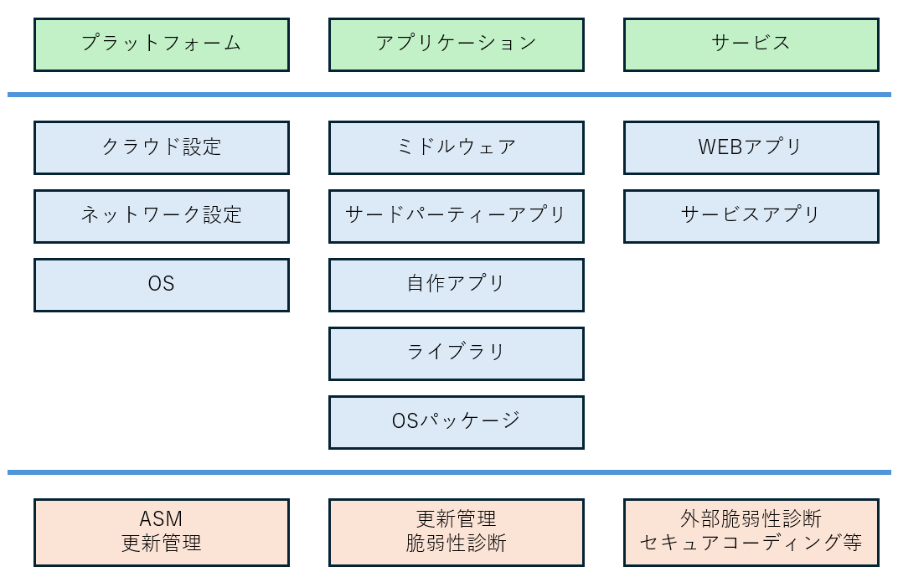

---

# "トリアージで決めるべきこと"

今後の第二章や第三章で述べられると思われますが、現時点の考慮点を示します。

## "対象の重要度評価" "脆弱性の危険度評価"

色々な判断方法はありますが、[OWASP Risk Rating Methodology](https://owasp.org/www-community/OWASP_Risk_Rating_Methodology)辺りが、比較的簡単で参考になると思います。
- 脆弱性の危険度を、`脅威因子(Threat Agent Factors)`と`脆弱性要因(Vulnerability Factors)`で評価しています
- 対象の重要度は、`技術的影響要因(Technical Impact Factors)`と`事業影響要因(Business Impact Factors)`で評価します
  - 評価方法は、例示に従って点数を入れていく方式であり、判断がぶれずらいと考えます

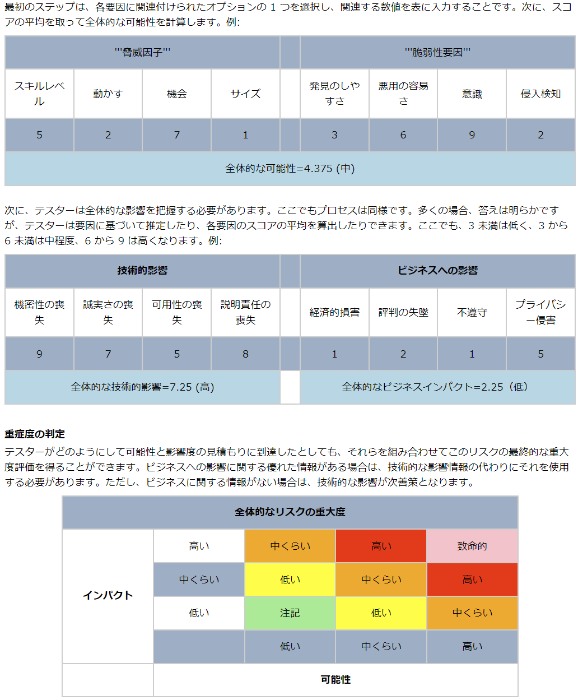

---
# .

SSVCでも同様な評価基準はありますが、ある程度の専門性がないと適用するのは難しいと思われます。
(適当にやるならできるが…)

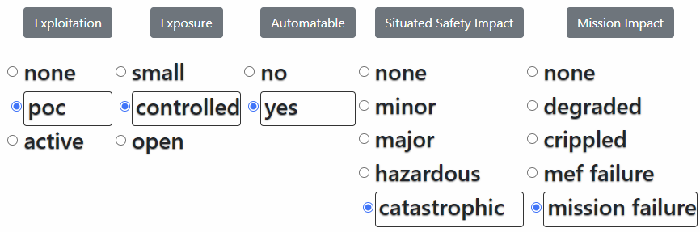 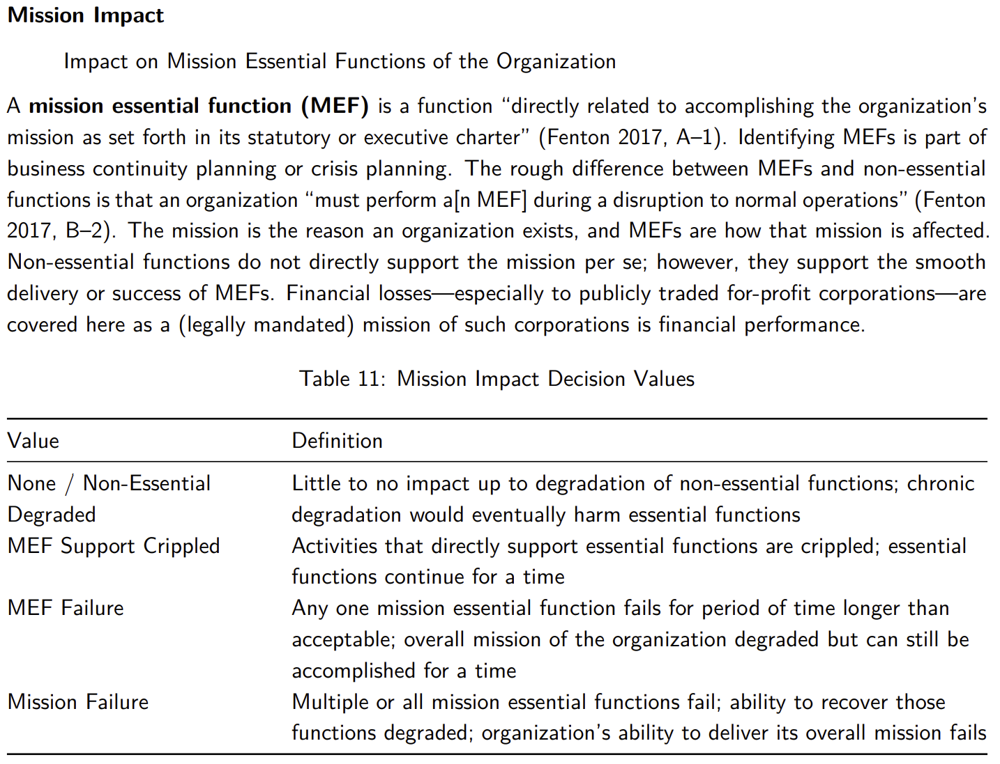

---

# 以上

今回は一旦ここまでとします。

まずは現場のトリアージの手助けとして本手引きを利用し、余裕が出てきたら、組織全体としての脆弱性管理の一環としてセリしていくのが良いと思われます。

---
# Appendix

- トリアージガイドライン作成の手引き
  - https://github.com/WebAppPentestGuidelines/TriageGuidelines/tree/main
- ISOG-J セキュリティ対応組織の教科書 3.1版
  - https://isog-j.org/output/2023/Textbook_soc-csirt_v3.html
- X.1060
  - https://www.itu.int/rec/T-REC-X.1060-202106-I
  - https://www.ttc.or.jp/document_db/information/view_express_entity/1423
- SSVC
  - https://insights.sei.cmu.edu/library/prioritizing-vulnerability-response-a-stakeholder-specific-vulnerability-categorization-version-20/
- OWASP Risk Rating Methodology
  - https://owasp.org/www-community/OWASP_Risk_Rating_Methodology
- InternetWeek2023で話したもの
  - https://www.nic.ad.jp/ja/materials/iw/2023/proceedings/c6/c6-inoue.pdf