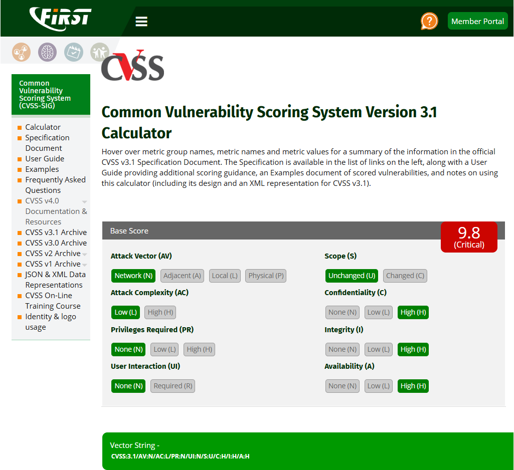
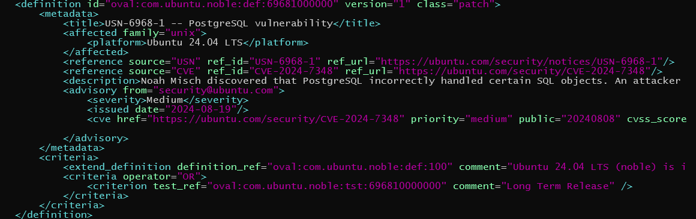
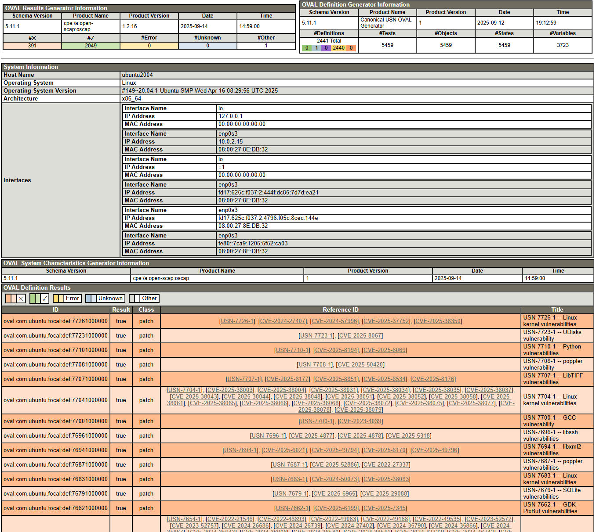

<!-- _class: title-->
# 初めてのSCAP
## CVE, CWE, CPEなどはどこから来たのか

hogehuga
2025-09-14

---
<!-- _class: paragraph -->
# はじめに

---

# はじめに & アジェンダ

この資料で説明すること
- SCAPとは何か
- なぜSCAPは生まれたのか、何なのか
- SCAPを構成する主要な要素たち（全部ではない）

本日のゴール
-  「CVEとかCWEとか色々あるね」という状態から、「こういう目的でCVEやCWEなどが作られたのか！」という理解を得る

---
<!-- _class: paragraph -->
# 1. SCAPとは

---

# 1.1. SCAPとは？（全体像）
- SCAPを一言でいうと：
  - 「情報システムのセキュリティ設定や脆弱性評価を自動化するための共通言語・フレームワーク」です
- SCAPが解決すること：
  - 手動での脆弱性チェックは手間と時間がかかる
  - ツールごとに結果の形式がバラバラで比較しづらい
  - 脆弱性の深刻度や種類を共通の基準で評価したい
- 重要なポイント：
  - SCAPは「単一のツール」ではなく、「CVE」や「CPE」など、複数の異なる標準を組み合わせて使う「仕組み」

---

# 1.2. SCAPの歴史
- 誕生のきっかけ：
  - 2002年、米国で成立したFISMA（連邦情報セキュリティ管理法）という法律が、連邦政府機関の情報セキュリティ管理を義務付けました
- NISTによる開発：
  - この法律の要求を満たすため、NIST（米国国立標準技術研究所）が脆弱性管理の自動化標準としてSCAPを開発しました
- 管理団体の分化：
  - 当初はNISTが全てを管理していましたが、セキュリティ情報の多様化と国際的な普及のため、専門団体が各標準を管理する体制に移行しました
- SCAPの進化：
  - 時代に合わせて更新され、現在はSCAP 1.3が最新版

---

SCAPの年表（当勉強会作成）

|バージョン|公開年|主な変更点|技術的特徴|
|:--|:--|:--|:--|
|FISMA|2002|連邦情報セキュリティ管理法の成立|SCAPの必要性を確立。SCAP公開までは手動によるセキュリティ管理が中心。|
|SCAP v1.0|2007|SCAPの初期公開バージョン|XCCDF、OVAL、CVE、CPE、CVSS v2.0といった初期コンポーネントの組み合わせを定義。主に設定管理と脆弱性評価の自動化を目的とした。|
|SCAP v1.1|2009|政府機関の要件への適合性強化|必須コンポーネントとして**CCE (Common Configuration Enumeration)**を導入（現在はCWEに統合）。セキュリティ自動化のための必須要件を明確化。|
|SCAP v1.2|2011|統合と機能の拡張|ARF (Asset Reporting Format)、CCSS (Common Configuration Scoring System)、OCIL (Open Checklist Interactive Language)、**TMS (Trust Model for Security Content)**など、コンポーネントを大幅に追加し、評価結果の報告機能を強化。|
|SCAP v1.3|2018|ソフトウェア資産管理（SAM）への対応強化|SWID Tags (Software Identification Tags)を必須コンポーネントとして導入。CVSSのバージョンをCVSS v3.xに対応。より包括的なアセット管理と評価を可能にした。|

---

# 1.3. 管理団体の分化
SCAPを構成する要素は、それぞれの専門家が管理しています。

| 要素名 | 管理団体・機関 | 役割 |
| :--- | :--- | :--- |
| CVE | MITRE Corporation -> CVE Foundation | 脆弱性の識別子を管理 |
| CWE | MITRE Corporation (with CVE Community) | ソフトウェアの弱点を分類・整理 |
| CPE | MITRE Corporation (part of NVD) | IT製品の命名規則を管理 |
| CVSS | FIRST | 脆弱性の深刻度をスコアリング |
| SWID | ISO/IEC | ソフトウェアの識別子を管理 |
| XCCDF/OVAL | MITRE Corporation (transferred to CISecurity) | 設定評価の記述言語を管理 |

もともとはMITREが中心でしたが、現在はNISTがSCAPの枠組み全体を統括し、各コンポーネントは国際的な普及と専門性向上のため、別々の団体が管理しています。

---
<!-- _class: paragraph -->
# 2. 最新のSCAP

---

# 2.1. SCAP 1.3の構成要素（全体像）
- SCAP 1.3が目指すこと：
  - 脆弱性だけでなく、ソフトウェア資産管理やセキュリティ設定評価まで、より広範なセキュリティ管理を自動化すること。
- **主要な**構成要素：
  - ID・識別子： CVE, CWE, CPE
  - 評価記述言語： XCCDF, OVAL, OCIL
  - 評価結果の報告： ARF
  - その他： CVSS, SWID Tags
    - 「XCCDFで設定評価のルールを記述」し、「OVALでシステムを検査」し、「見つかった脆弱性をCVEで識別」し、「その深刻度をCVSSで評価」する

---

# 2.2. CVE（Common Vulnerabilities and Exposures）

- 概要：
  - 既知の脆弱性に対して、世界共通のユニークなIDを付与するリストです。
- どう登録される？：
  - 世界中の「CNA（CVE Numbering Authority）」と呼ばれる組織（ベンダー、研究機関など）が脆弱性を発見・公開し、CVE番号を申請・登録する
- 例：
  - CVE-2021-44228
    - 通称「Log4j脆弱性」として知られる、インターネット全体に大きな影響を与えた脆弱性

---

補足：CVE登録プロセス

 from https://www.cve.org/About/Process

|   |                   |   |
|:--|:------------------|:--|
|1. |Discover（発見）   |脆弱性を発見する（発見者）|
|2. |Report（報告）     |発見者が CVEプログラムパートナー に脆弱性を報告|
|3. |Request（割当要求）|CVEプログラムパートナーはCVE-IDを割当|
|4. |Reserve（予約）    |CVE-IDが予約済み状態となる|
|5. |Submit（提出）     |CVEプログラムパートナーが詳細を提出する|
|6. |Publish（公開）    |担当のCNAによってリストに公開される|

CVE Program Parrtner：CVEプログラム全体の協力者（CNAより広範囲）
CNA(CVE numbering Authority)：CVEプログラムパートナーの実務を担う

---

# 2.3. CWE（Common Weakness Enumeration）

- 概要：
  - ソフトウェアの設計やコーディングに潜む「弱点（Weakness）」を分類したものです。
- CVEとの違い：
  - CVEは「何が危険か（個別の脆弱性）」
  - CWEは「なぜ危険か（脆弱性の原因となる弱点の種類）」
- 例：
  - CWE-89：「不適切なSQLクエリの組み立て」
  - 近年はAIに関するCWEも追加されている
    - 例　CWE-1434: Insecure Setting of Generative AI/ML Model Inference Parameters (生成AI/MLモデルの推論パラメーターの安全でない設定)

---

# 2.4. CPE (Common Platform Enumeration)

CPE：Common Platform Enumeration
- 概要：
  - オペレーティングシステム、アプリケーション、ハードウェアなどのIT製品を識別するための統一された命名規則です。
- どう使われる？：
  - CVE情報と紐づけて、「どの製品の、どのバージョンに脆弱性が存在するか」を正確に特定するために使われます。
- 例：
  - cpe:/o:microsoft:windows_server_2016
  - cpe:/a:apache:http_server:2.4.54

---

# 2.5. CVSS (Common Vulnerability Scoring System)

- 概要：
  - 脆弱性の深刻度を客観的な指標で評価するための採点システムです。
- どう算出される？:
  - 脆弱性の悪用可能性（攻撃ベクトル、複雑性など）、影響範囲（機密性、完全性、可用性）など、複数の要素に基づいてスコアを算出します。
- 例：
  -  スコア：0.0～10.0
     - 9.8 (Critical): 深刻度が非常に高い。Log4jの脆弱性などが該当します。
     - 6.3 (Medium): 中程度の深刻度。

---

スコアは、脆弱性に関する3つの評価基準（基本、現状、環境）により計算されます。このうち、基本評価基準（Base metrics）について概説します。

| 項目名           | 略称 | 概要                                                           | 取りうる値 |
| :--------------- | :--- | :------------------------------------------------------------- | :--------- |
| 攻撃元区分       | AV   | 脆弱性のあるコンポーネントをどこから攻撃可能であるか           | N,A,L,P    |
| 攻撃条件の複雑さ | AC   | 脆弱性のあるコンポーネントを攻撃する際に必要な条件の複雑さ     | H,M,L      |
| 必要な特権レベル | PR   | 脆弱性のあるコンポーネントを攻撃する際に必要な特権レベル       | N,L,H      |
| ユーザ関与レベル | UI   | 脆弱性のあるコンポーネントを攻撃する際に必要なユーザ関与レベル | N,R        |
| スコープ         | S    | 脆弱性のあるコンポーネントへの攻撃による影響範囲               | U,C        |
| 機密性への影響   | C    | 対象とする影響想定範囲の情報が漏洩する可能性                   | H,L,N      |
| 完全性への影響   | I    | 対象とする影響想定範囲の情報が改ざんされる可能性               | H,L,N      |
| 可用性への影響   | A    | 対象とする影響想定範囲の業務が遅延・停止する可能性             | H,L,N      |

※ 日本語参考元： https://www.ipa.go.jp/security/vuln/scap/cvssv3.html

---
右図のように、基本評価基準値を計算することで、Base Scoreが算出されます。
- https://www.first.org/cvss/calculator/3-1

---

CVSS年表（当勉強会作成）

|バージョン|公開年|主な変更点|技術的特徴|
|:--|:--|:--|:--|
|CVSS v1.0|2005|初期バージョン|脆弱性評価の概念を確立。スコア算出のための3つの評価基準（基本・現状・環境）の基礎が作られた。|
|CVSS v2.0|2007|広く普及したメジャーバージョン|評価項目の明確化と計算式の改善。SCAP v1.0の必須コンポーネントとして採用され、国際的な標準としての地位を確立。|
|CVSS v3.0|2015|メジャーアップデート|仮想化技術などの新しい技術環境を考慮し、評価項目を大幅に見直し。「スコープ」の概念を導入し、影響がシステム内部にとどまるか、外部に波及するかを評価可能にした。|
|CVSS v3.1|2019|v3.0のマイナー改訂版|スコアリングの基準や計算式に大きな変更はないが、v3.0の仕様の明確化と曖昧さの解消に焦点を当てた。CVSSスコアは「深刻度」を示すものであり、単独で「リスク」を測るものではない、という点が強調された。|
|CVSS v4.0|2023|最新のメジャーバージョン|OT (Operational Technology) 環境への対応を強化。現状評価基準を「脅威評価基準」に改名し、脅威の側面をより重視。また、後続システムへの影響を評価項目に追加するなど、現代のセキュリティ環境に合わせた詳細な評価を可能にした。|

---

# 2.6. OVAL（Open Vulnerability and Assessment Language）
- 概要：
  - システムの脆弱性や設定を評価するための、コンピュータが解釈可能な言語です。
- 役割：
  - 「このバージョンのWindowsは、特定のレジストリ設定がこうなっているか？」といったチェックをXML形式で記述します。

---

例

---

# 2.7. SWID Tags（Software Identification Tags）
- 概要：
  - ソフトウェアのインストール状況やライセンス情報（GPLやApache License等）などを識別するための標準タグです。
- 役割：
  - 資産管理ツールが、PCにインストールされているソフトウェアを正確に特定し、脆弱性情報を照合するのに役立ちます。
- 補足：
  - SBOM（Software Bill of Material）の記述形式として利用されます。
  - 対象に含まれるソフトウェアやライブラリなどの名前やバージョン、ライセンスなどを記載します。

---

# 2.8. SCAPを利用した、脆弱性検査

SCAPの枠組みを使った脆弱性検査ツール OpenSCAP というものがあります。
- https://www.open-scap.org/
  - オープンソースのコミュニティーが管理している

HTML出力例を示します。

---
<!-- _class: paragraph -->
# 3. まとめ

---

# 3. まとめ

SCAPは、情報セキュリティ管理を自動化・標準化するための共通言語です。

- CVEやCWEなど、それぞれの専門家が管理する複数の標準をNISTがフレームワークとして統合しています。
- SCAPを利用することで、脆弱性管理やセキュリティ設定の効率的な運用が可能になります。

よく使うフレームワークや仕組みは、気になったときに調べてみると役に立つことがあります。

---
<!-- _class: paragraph -->
# X. Appendix

---
# Appendix

- CVE
  - MITRE Corporation https://www.cve.org/
    - 登録プロセス https://www.cve.org/About/Process
- CWE
  - MITRE Corporation https://cwe.mitre.org/
- CPE
  - NIST https://nvd.nist.gov/products/cpe

---

- CVSS
  - FIRST https://www.first.org/cvss/
  - 脆弱性対応勉強会 https://github.com/hogehuga/vulnRespStudyGroup/tree/master/document/announcingCVSSv40
    - 当勉強会でのCVSS v4の解説
- SWID
  - ISO/IEC https://www.iso.org/standard/66528.html
  - NIST https://csrc.nist.rip/projects/software-identification-swid/
- XCCDF
  - NIST https://nvd.nist.gov/ncp/repository
- OVAL
  - CISecurity https://oval.cisecurity.org/

---

- SCAP
  - NIST https://csrc.nist.gov/projects/security-content-automation-protocol
  - IPA https://www.ipa.go.jp/security/vuln/scap/index.html
    - ここから、CVEやCPEなどの日本語解説にもリンクしている（が古い）
- OpenSCAP
  - https://www.open-scap.org/

---

# 改訂履歴

| 日時       | 概要                              |
| :--------- | :-------------------------------- |
| 2025-09-14 | 初版作成                          |
| 2025-09-28 | 誤記修正（SCAP年表） 、資料追加(CWEにAIの記述、CVSS基本評価基準及びCalcuratorの例と年表、OVALの例示、OpenSCAPの追加、改訂履歴)、記載の適正化 |