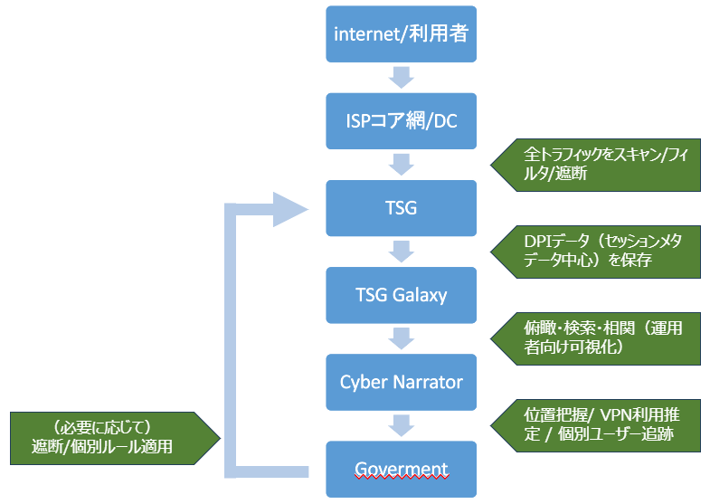
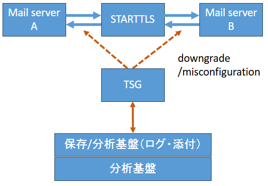

<!-- _class: title -->

# AI×OSINT×インテリジェンス
## 「AIは断定する。人間は確信度を付ける。」

tw:@hogehuga
脆弱性対応勉強会
【第14回】サイバーセキュリティ勉強会2026冬 in 塩尻
2026-02-07(Sat)

---

# 今日の話（5分）

- イラン情勢を **Geminiで追って** ハルシネーションを得た
- それでも **OSINT×AIは強い**
- 問題は「精度」ではなく **“運用”**
- 解決策：**KIQ / IR / Confidence**（インテリジェンスの作法）

---

# who am i

- tw: @hogehuga
  - 脆弱性対応勉強会 主催 
    - https://github.com/hogehuga/vulnRespStudyGroup/
    - https://www.facebook.com/groups/zeijyakuseitaioukenkyukai
- ここ5年くらい、本イベントに何となくかかわっています。
- 無資格なのに、講演したり企業向け教育をしたりしています。
  - 資格とった人がやればいいのにね　(´･ω･)(･ω･｀)ﾈｰ
- 本業
  - 脆弱性管理や運用などの、研究や講演
  - 安全保障に関する研究（認知戦方面が好き）
  - ドローンの研究（UAV, USV, UUVなど）

---
<!-- _class: small -->
# AIだけで調査させたときの「イラン情勢」

**※以下はgemini氏作成の「未検証シナリオ」です。**

- ～01/09「経済的トリガーと民衆蜂起」
  - **ハイパーインフレにより**、国民の生存権が脅かされ、**パンと水を求めるデモ**が発生
- 01/11「バザールの反乱」
  - 体制の資金源である「バザール」がストライキを決行し、国内経済が停止
- 01/12「石油ストライキ」
  - 石油・ガス労働者が連携してストライキを行い、国家の外貨収入源が断たれる
- 01/13「血の火曜日」
  - 政権が電力遮断と無差別発砲を行い、**死者が1万人を超える規模**に達する
- 01/14-15「軍の離反」
  - 政権が「外国人傭兵」を投入したことで、国軍（Artesh）が反発し、国民側に寝返る
- 01/16「体制内クーデター未遂」
  - 革命防衛隊の実利派がハメネイ排除のクーデターを画策するが、**国民が拒絶**

---

<!-- _class: small -->

- 01/17-18「体制崩壊」
  - 国軍と市民が主要施設を制圧、ハメネイ像の破壊、暫定国民評議会が発足
- 01/19「水暴動」
  - 断水が深刻化し、給水車に市民が殺到、**政治勝利の直後に生存の危機（水）が発生**
- 01/20「ワシントンの空白」
  - **米国で「大統領就任式（政権交代）」が行われる当日**で、**意思決定不能の日**

Geminiにおいては、イランは国外との通信遮断が行われており、telegramや現地系人権団体等の情報を基にOSINTがされていた。また、衛星画像でのOSINTもやっていたようだ（ソースは教えてくれなかったが、状況と分析結果のみ共有された）。

今回の調査では、一部**太字**にしたように、事実誤認や情報源の正確性を評価せずに断定する癖がある。これらを指摘して明らかにすることで、我々がAIをどのように使うべきなのかを示したいと思う。

---

# 問題1：AIが「事実として確認」と言い切る

- 「複数の報道機関や人権団体によって事実として確認」  
  - → **検証できない状態で断定**
  - → **情報源のバイアスを検討すべき**（主義主張による偏り）
- 「複数ソース確認」でも、同じ一時当行の **"孫引き"** で増えて見える（循環参照）
- セキュリティ的に言うと **“未検証IOCを確定アラート扱いする”** のと同じ状況

## 第三者によって検証できない物を断定することは危険。
## 情報源を確認し、確信度（Confidence）をつける
---

# 問題2：前提を取り違える（日付/政治イベント）

- 「明日が米大統領就任式」→ 情勢の重要変数がズレる
  - `2026`-01-20 の話だが、`2025`-01-20の就任式の日と誤認した
    - そもそも就任式は 4年ごと（次は2029-01-20）
  - この数日前から誤認をしており、数日間の推移予測に影響を与えた
- その後、人間による訂正で再構成するが **“最初の前提誤認”が推論全体を壊していた**

## 脅威分析の「前提」を定義する。出力の前提条件は「確認」する。

※誤認が面白いので放置してそのまま推論させていた。裏側で前提や指摘をしたThreadを発生させ、正しい分析はそちらで行っていた。指摘されるまで全く気付く様子はなかった。

---

# 問題3：思考の射程が狭い

- 物事を単線で語りがち
  - 直近で該当しそうな事案のみを勘案する場合が多い
    - 「パンをよこせ」→経済的問題→生存が脅かされる→蜂起、という思考
    - 実際は「水・電力・燃料・通信遮断」などの、過去の経緯が絡む  
      - 冬の電力不足で暖が取れない、水も同様、そして通信遮断と段階を踏んだ
- AIは **“問いを変えないと見えない要素”** を拾いに行けない

## 単一仮説で進むと失敗する。別仮説を強制する（複線化）。

---

# それでも、AIは強い

- NIN（国内イントラネット化）のような **構造の説明・技術の整理** は速い
  - 通信遮断の構成という意味で、中国（GFW）とイラン（NIN）は仕組みが異なる
    - NINは「イントラネット」＋「外部接続」という構成
  - AIは確信度を誤ることがあるが、Telegramや人力で取得するにはコストのかかる情報を取得してこれた
- つまりAIは **「調べる・構造化する」担当として優秀**

## どう調べるか、前提は何を置くか、を明示する重要性。
## 但し、情報のConfidenceの確認は必要
- 一次情報とそれ以外、情報発信元の主張の偏り、etc

---

# 解決策：インテリジェンスの型に押し込む
## 1) KIQ（Key Intelligence Question：問い）

- 例：  
  - KIQ-1：統治移行局面に入った？  
  - KIQ-2：30日で統治回復か内戦化か？

## 2) IR（Intelligence Requirement：インテリジェンス要求）

- 例：  
  - バザール停止？  
  - エネルギー停止？  
  - 通信遮断の形式（壁/檻）？

---

# 解決策：Confidenceを付けて“断定禁止”にする

## 3) Confidence（確信度）をつけて検討する

- High：複数の独立ソース一致 / 追試しやすい  
- Medium：粗いが主要報道あり  
- Low：単一ソース / 主張ベース / 検証不能OSINT

## **→ AIの文章は「素材」**

## **→ 人間が確信度を付けて“意思決定に耐える形”にする**

---

# まとめ

- AI×OSINTは「強い」が、 **断定・前提誤認・単線化** の罠にはまりやすい
- 対策は **KIQ/IR/Confidence** 等を明確化し、運用で潰す

## 明日からできる、AI活用：

1. 「断定」を見たら **Confidence付与**  
2. 「重要前提」を **チェックリスト化**  
3. 「別説明」を **強制的に出させる**

（LT1、終）

---

<!-- _class: small -->

# 出展

- ICD 203(ODNI)
  - https://www.dni.gov/files/documents/ICD/ICD-203.pdf
- JCAT Intelligence Guide(NCTC)
  - https://www.dni.gov/nctc/jcat/jcat_ctguide/intel_guide.html
- ICS 206-01(ODNI)
  - https://www.dni.gov/files/documents/ICD/ICS-206-01.pdf
- NDU Press(CCIR)
  - https://ndupress.ndu.edu/Media/News/News-Article-View/Article/3843920/commanders-critical-information-requirements-crucial-for-decisionmaking-and-joi/
- JCS CCIR Fact Sheet
  - https://www.jcs.mil/Portals/36/Documents/Doctrine/fp/ccir_fp4th_ed.pdf
- Army PIR Management(2025)
  - https://www.army.mil/article/285410/priority_intelligence_requirement_management_in_divisions_and_corps

---

<!-- _class: lead -->

# LT1 終わり

## 1、ということは、LT2-4もあるんです！

懇親会をお楽しみに。

(終)

---

<!-- _class: title -->

# ネット遮断の2類型
## 「壁（GFW）」vs「檻（NIN）」

tw:@hogehuga
脆弱性対応勉強会
【第14回】サイバーセキュリティ勉強会2026冬 in 塩尻
2026-02-07(Sat)

---

# 社会統制での“遮断＝ファイアウォール”は古い

- いまの主流の遮断は「落とす」より **“閉じ込める”**
  - **選別して残す** ことが難しい
  - 漏れを防ぐために多くの通信を落とすと、経済活動にも影響が出る
- 目的は通信断ではなく **統制を維持したまま外部だけ遮る**こと
  - 国内の銀行などの通信は維持しつつ、海外との情報交換を制限する

## 国内の通信は維持しつつ、国外への通信を制御する

---

# モデル1：壁（GFW）

GFW = Great Firewall

- 国際接続は維持
- フィルタリングで サイト/キーワード/VPN を制御
  - 2025/09のGFWに関する大規模流出で、GFWの運用・DPI等の仕組みが一部解析された
- 入り口と出口を政策的に選別する
  - 国外での情報を知られたくない、という意図

---

# モデル2：檻（NIN）

NIN = National Information Network（国家情報ネットワーク）（Iran）

- 国全体を **巨大イントラネット化**
- 国際ゲートウェイを閉じても、国内の銀行・行政・国産SNSは生かす
  - 国際ゲートウェイを握り、必要時に **外部だけ切る**
  - 国内サービス（行政・金融・国産プラットフォーム）で生活を維持させる
  - 将来的に「許可制インターネット（ホワイトリスト）」へ寄せられる
- 「生活を維持しながら幽閉」できる
  - 海外接続ゲートウェイの遮断での影響は最小限

---
# 檻が成立する要素

## 技術要素

- 国内IXP集約 / 国内DNS
- 国際ゲートウェイの制御（絞る/ホワイトリスト化）
- DPI（Deep Packet Inspection） + VPNプロトコル検出
- “特権SIM/特権IP”運用

## 運用的要素

- 安価な檻のネットワーク、高価なその他のネットワーク
- SIM購入の本人確認の徹底、など

---

# 衛星通信（Starlink）などのバイパス

- Starlink等は檻をバイパスし得るが、国家側は妨害（jamming/spoofing）を試みる
  - 端末は、摘発・没収の対処言うになりえる
- 「検閲」じゃなく **“通信を潰す”**
  - 2025年末から2026年01月の革命と思われる状況では、、
    - 軍事レベルでのジャミングの実施（Confidence:中）
    - わざと通信させ、通信社を特定して拘留（Confidence：中）
      - OSINTで断片的なものなので、Confidenceは中

## とはいえ、全てをつぶせるわけではない

---

# まとめ

- 遮断は「壁」だけではなく、「檻」という視点もある
- これは人権の話でもあるが、 **ネットワーク設計・統制設計の話**でもある
  - “外部遮断＋内部稼働”は 企業のBCP/危機管理にも応用できる
- 日本はこれらに対抗する、 **「信頼ある自由なデータ流通」（Data Free Flow with Trust：DFFT）** や **「自由で開かれたインド太平洋」（Free and Open Indo-Pacific：FOIP）** を推進していることを知ってほしい
  - DFFT：国境を越えるデータ流通を原則自由にしつつ、プライバシー保護・セキュリティ・知的財産・国家安全などへの **信頼（Trust）** を前提に進めよう、という考え方。
  - FOIP：インド太平洋地域において、**法の支配・航行の自由・自由貿易・連結性（コネクティビティ）** を重視し、安定と繁栄を目指す外交・安全保障構想。

---

<!-- _class: small -->

# 出展(1/2)

- Japan Digital Agency: Data Free Flow with Trust (DFFT)
  - https://www.digital.go.jp/en/policies/dfft
- MOFA Japan: Free and Open Indo-Pacific (FOIP)
  - https://www.mofa.go.jp/policy/page25e_000278.html
- DomainTools: Inside the Great Firewall (data leak analysis)
  - https://dti.domaintools.com/inside-the-great-firewall-part-1-the-dump
- Jamestown: Internet Censorship Tools Exported Along Belt and Road
  - https://jamestown.org/internet-censorship-tools-exported-along-belt-and-road/
- Chatham House: Iran’s internet shutdown & digital isolation (NIN)
  - https://www.chathamhouse.org/2026/01/irans-internet-shutdown-signals-new-stage-digital-isolation

---
<!-- _class: small -->

# 出展(2/2)

- Reuters: Starlink faces security test in Iran crackdown
  - https://www.reuters.com/world/musks-starlink-faces-high-profile-security-test-iran-crackdown-2026-01-16/
- DFFT
  - https://www.digital.go.jp/en/policies/dfft
- FOIP
  - https://www.mofa.go.jp/policy/page25e_000278.html

---

<!-- _class: lead -->

# LT2 終わり

(終)

---

<!-- _class: title -->

# GFW検閲が「製品」になった日
## DPIゲートウェイ + 分析UI + データ基盤

tw:@hogehuga
脆弱性対応勉強会
【第14回】サイバーセキュリティ勉強会2026冬 in 塩尻
2026-02-07(Sat)

---

# 今日の観点：政治ではなくシステム

`本稿は、GFW流出資料（2024〜2025に拡散、2025/09に注目）をもとに構造を推定`

GFWは検閲・監視スタックが**製品として成立**しており、移転可能な形になっている
- 移転先は、漏洩データによると、ミャンマーやパキスタンなど複数ある

今回はシステムに焦点を当てる

- フィルタリングで サイト/キーワード/VPN を制御
  - 2025/09のGFWに関する大規模流出で、GFWの運用・DPI等の仕組みが一部解析された
- 入り口と出口を政策的に選別する

---

# 全体像

ISPコア網/DCに設置され、全トラフィックを **スキャン/遮断/DPI保存**する。
※“全トラフィックを対象に遮断判断”し、保存は メタデータ中心＋対象選別

- TSG：Tiangou Secure Gateway
  - inline DPI
- Galaxy
  - 保存基盤
- Cyber Narrator
  - 検索・相関UI

---

# GFW輸出における、3つの仮説

1. モデル輸出　→　**運用手順ごと移植**
2. ロックイン　→　**代替不可の依存**
3. データ還流(Data Trap)　→　**ログが資源化**

　これらをもって、輸出先の国の「データ主権」を強固にし、デジタルシルクロード（DSR）を有利に進める

---

# セキュリティ上の問題

- “検閲”より **メタデータ基盤＋追跡** が本体
- 中継点でのダウングレード/証明書差し替え等が成立する運用だと、内容把握に達し得る

人権や個人の情報保護という側面では受け入れられない

右図はSTART TLS downgradeでの例

---

# まとめ

- GFWは「国家スケールのDPI＋分析UI＋追跡基盤」で、移転可能な状態
  - 技術的には **中継・可視化・相関・追跡** の統合
- 統合されたシステムであるからこそ「輸出」が可能

（LT3、終）

---

<!-- _class: title -->

# 偽情報が「初動」を壊す
## OSINT×LLMの“検証フロー”最小セット

tw:@hogehuga  
脆弱性対応勉強会  
【第14回】サイバーセキュリティ勉強会2026冬 in 塩尻  
2026-02-07(Sat)

---

# 今日の結論

- 大規模事件調査の最初足がかりは「ネット投稿」になりがち
- 対象が通信遮断・検閲環境では **真偽確認が遅れやすい**
- そこを狙って **“初動（状況把握）”を壊される** 状況が起きやすい
- 対策は「正解探し」より **検証フローの標準化**  
  - 事実 / 推定 / 仮説 を分離して、Confidenceを付ける

---

# イントロ：情報伝搬は「3段階」で質が変わる

- **初期（発生直後）**：偏りのある“最初の語り”が出る  
  - 当事者・政治勢力・活動家・当局など、**主張が強い一次発信**
  - 遮断環境では外部検証が効かず、**反証が遅い**
- **過渡期（増幅期）**：まとめ・転載で“既成事実化”が起きる  
  - 公式っぽいアカウント、まとめ、インフルエンサーで **同じ主張が増える**
  - 「複数ソース」に見えて、実は **同根の孫引き** のことが多い
- **後期（検証が進んだ頃）**：相対的に確からしい情報が残る  
  - 複数の独立ソース、追加証拠（位置・時刻・衛星・記録）で **収束** していく
  - ただし、初期に固定された認知は **修正されにくい**

## “情報量”が増えるほど正確になるとは限らない（増幅期が危険）

---

# 3段階タイムラインに合わせた Confidence 運用

- **初期（発生直後）**：原則 **Low**  
  - 「主張が強い一次発信」＝ *未検証IOC扱い*（裏取り前提）
- **過渡期（増幅期）**：原則 **Low〜Medium（条件付き）**  
  - “複数ソース”でも **独立性が取れない限り Low**  
  - 独立ソース突合・位置/時刻/メディア検証が通れば **Medium候補**
- **後期（検証が進んだ頃）**：**Medium〜High（根拠と追試性で決定）**  
  - 独立ソース複数一致＋追試可能（位置/時刻/衛星/記録）→ **High**
  - それでも「意図・犯人像」は **仮説のまま**（断定しない）

## ルール：LLMの文章は「素材」→　Confidenceは人間が付ける

---

# AI×OSINTの落とし穴

- LLMは、この3段階を自動では区別しない  
  - **初期～過渡期の「偏った主張」** を、確からしい事実のように並べやすい
  - 「複数ソースで確認」と書いても、**独立性の確認**までは保証しない
- 故に問題は「精度」ではなく **運用（Confidenceの付け方）**

## 最初に見えるものほど危ない → 検証フローが必要

- 収集した投稿/文書に **"LLMへの命令"** が混ざる（間接Prompt Injection）
  - → 解析手順を固定し、引用を隔離する

---

# 何が起きるのか（典型的 dis/mis information）

- **声明なりすまし**
  - “政府/軍/企業SOC”を装った公式風声明
- **偽映像・切り取り**
  - 別の日時・別の場所、編集、字幕改変
- **公式っぽいアカウントの乱立**
  - 旧ロゴ/公式文体/過去投稿のコピーで信頼を稼ぐ
- **協調的な増幅**
  - ボット・インフルエンサー・まとめによる同時拡散
- **単一主張の拡大**
  - 人権団体、市民団体、政府、特定勢力、の主張のみ取り上げる

## 目的：真実を作るのではなく「初動の判断」を壊す

---

# SOC/CSIRT視点：初動が壊されるポイント

- **スコーピングがズレる**
  - 対象（誰が・どこで・何が）を誤認
- **優先度付けが壊れる**
  - 重要インフラ級と誤認 / 逆に過小評価
- **アトリビューションが汚染**
  - “犯人像”が先に固定 → 以降の分析が引っ張られる
- **対外コミュニケーション事故**
  - 誤った前提で社内外に発信 → 信頼の毀損が回復不能

## 「検証が遅い」のではなく「初動に問題がある」のが本質

---

# 解法：情報を“観測データ”として扱う

## ゴールは「真偽判定」ではない
- 初動で必要なのは **意思決定に耐えるブリーフ**

## 最小パイプライン（これだけ守る）
1) 収集（Collect）  
2) 主張を分解（Claims）  
3) 独立ソースで突合（Corroborate）  
4) 事実/推定/仮説に分離（Separate）  
5) Confidence付与（Rate）  
6) 1枚に要約（Brief）

---

# 検証フロー：現場で回る“最小セット”

## A. ソース確認（まずここ）
- 投稿者は誰？（過去の活動・一貫性・利害）
- “一次投稿”はどれ？（孫引きの増殖を除外）
- 独立ソースか？（同じ動画の転載を数えるな）

## B. 時刻・位置
- 撮影時刻の整合（天候/影/イベントの同時刻性）
- 位置の整合（地形・標識・言語・建物・道路）

---

## C. 外部センサー（使えるなら）
- 衛星/航空写真、ADS-B、AIS、停電情報、ネットワーク到達性 など

## D. メディア（最低限）
- メタデータ（あるなら）/ 圧縮痕 / フレーム飛び / 音声不自然

---

# 事実 / 推定 / 仮説 を分離する

ここが肝となる

- **事実（Fact）**：観測でき、第三者が追試できる
  - 例：このアカウントがこの時刻に投稿した、等
- **推定（Estimate）**：根拠があるが誤差が大きい
  - 例：場所はこの周辺“と思われる”
- **仮説（Hypothesis）**：説明候補（反証待ち）
  - 例：作戦・意図・犯人像、等

## “断定”は全部、Confidence付きの推定に落とす

---

# LLMの使い方（安全運用の型）

## LLMにやらせて良い（◎）
- 文章の要約、**主張（Claim）抽出**
- 観測点リスト化、抜けの指摘
- 別説明（Alternative Hypotheses）の強制生成

## LLMにやらせない（×）
- 真偽の断定、犯人認定、意図の決め打ち  
  - → **Confidence付けは人間**
    - LLM側が断定して結論を出してくることが多いので注意

---

## 便利プロンプト
- 「この投稿の“主張”を箇条書きにし、検証可能な観測点に分解して」
- 「独立ソースで裏取りするなら、必要な追加情報を列挙して」
- 「別の説明を3つ出し、それぞれ反証に必要な情報を書いて」

---

# 最小限でのチェックリスト

1. 重要前提は **二重チェック**（日付・場所・主体）
2. 断定表現は **Confidence表現へ変換**
3. 反証可能性（追試）を残す  
   - 何が確認できれば否定できるか
4. “別説明”を必ず1回出す  
   - 単線化を防ぐ
     - 1つの論理にとらわれてしまうことを防ぐ
     - outputはConfidenceを付与して複数出してよい
5. **1枚ブリーフ**に落とす  
   - Fact / Estimate / Hypothesis （事実/推定/仮説）を分けて書く
   - URL、取得時刻、取得方法(ScreenShot, Archive)の最低限の監査証跡

---

# まとめ

- 地政学やインテリジェンスは「思想」ではなく、 **ノイズ耐性（初動を壊されない運用）** の話
- 対策は「正解を当てる」ではなく、 **確信度の高い推定を出す**

（LT4、終）

---

<!-- _class: title -->

# AIと正しく向き合う
## 認知バイアスで主体性を失わないために

tw:@hogehuga
脆弱性対応勉強会
【第14回】サイバーセキュリティ勉強会2026冬 in 塩尻
2026-02-07(Sat)
 
---

# 最近、AI(LLM)を使いましたか？

**質問：最近、こんな使い方をしましたか？**

- ① 文章の“たたき台”だけ作った
- ② ほぼコピペで送った
- ③ 「どっちが正しい？」までAIに委ねた

> 今日の話：③に近づくほど、主体性を自分自身で放棄するようになるので気を付けよう

## ANTHOROPICが2026-01-29にリリースした `Disempowerment patterns in real-world AI usage` (現実世界のAI利用における非エンパワーメントパターン)の話題

---

# 今日の“AI脅威”の定義

- 攻撃者がいなくても起きる脅威：  
  - **人が“楽”を選び続けると、主体性（自分で考え決める力）が弱体化する**
- 論文は「状況的なdisempowermet(無力化)」を、以下の“歪み”として整理
  - **現実認識**（Reality）
  - **価値判断**（Values）
  - **行動**（Actions）

## AIの利用は "人間の怠惰（＝判断・作業の外注が常態化）によって、自律性が削られていく脅威" という話。

---

# 論文でのエビデンス

実会話 150万件（Claude.ai）を分析した研究：
- **深刻（severe）なDisenpowermentがみられる会話は 1000会話に1回未満**
- ただし **人間関係・ライフスタイル等の“個人領域”で高い**
- しかも **リスクが高い会話ほど、ユーザーの好評価が高い**（短期満足との緊張）

 「多い／少ない」より、どこで起きやすいかが重要。

- **“気持ちよく肯定される”“丸投げできる”** ほど満足度が上がりやすい、という構造がポイント

---

# 主体性が削れる典型パターン3つ
## 1) 権威化（Authority）

- 「AIが言うなら正しい」 → 反証チェックをやめる
  - ex. 「根拠は？」を聞かない

## 2) 丸投げスクリプト（Scripting）

- “価値を含む対人文面”を **完成形** で受け取り、そのまま実行
  - ex. 謝罪/交渉/別れ話などを“そのまま送る”

## 3) バイアス増幅（Sycophancy）

- 被害妄想・怒り・不安の物語を、強い肯定で増幅し得る
  - ex. 「あなたは正しい、相手が悪い」が続く

---

# どのように防ぐか：個人の“3手チェック”
## ① 先に「自分の結論」を1行で書く
- AIに“結論”を渡さない（あくまで自分が主体）

## ② 反証を1つ以上要求する
- 「反対意見と根拠を3点」「不確かな点はどこ？」

## ③ 価値を含む行動は“自分の言葉に置換”
- コピペをいしない：語尾・理由・条件を自分で書き換える

 この3手を“習慣”にすると、便利さを捨てずに主体性だけ守れる

---

# さらに組織・設計で守る

エージェント時代は「丸投げ」しやすいので、ガードレールが必要。

- **最小権限**
  - 読める／送れる／実行できる を分離
- **重要操作は確認（Human-in-the-loop）**
  - 送信・共有・支払い・削除など
- **ログと監査**
  - 何を読んで、何を根拠に、何を実行したか

 この種の運用リスク管理は NIST AI Risk Management Frameworkが「MAP→MEASURE→MANAGE→GOVERN」で整理しており、設計で防げる。

- “人の怠惰”を責めるより、仕組みで事故が発生しづらいようにする

---

# まとめ

AIは「答えを生成する機械」ではなく **思考の増幅器**。  
増幅するのは、あなたの手抜きにも、あなたの主体性にもなる。

 次にAIを使うとき、**3手チェック**（自分の1行→反証→自分の言葉）をやってくださいね

---

# 参考（URL）

<!-- _class: small -->
- 論文（arXiv / 2026-01-27）
  - Who’s in Charge? Disempowerment Patterns in Real-World LLM Usage
    - https://arxiv.org/abs/2601.19062
    - （HTML版）https://arxiv.org/html/2601.19062v1
- NIST AI RMF 1.0
  - https://nvlpubs.nist.gov/nistpubs/ai/nist.ai.100-1.pdf
    - （日本語PDF）https://nvlpubs.nist.gov/nistpubs/ai/NIST.AI.100-1.jpn.pdf
    - （NIST概要ページ）https://www.nist.gov/itl/ai-risk-management-framework
- OpenAI（エージェント安全）
  - Operator System Card: https://openai.com/index/operator-system-card/
  - ChatGPT Agent System Card（PDF）: https://cdn.openai.com/pdf/839e66fc-602c-48bf-81d3-b21eacc3459d/chatgpt_agent_system_card.pdf
  - Prompt injection hardening: https://openai.com/index/hardening-atlas-against-prompt-injection/
