<!-- _class: lead -->

# IPA `ソフトウェア等の脆弱性関連情報に関する届け出状況` を読み解く

2021/05/23
脆弱性対応勉強会

---

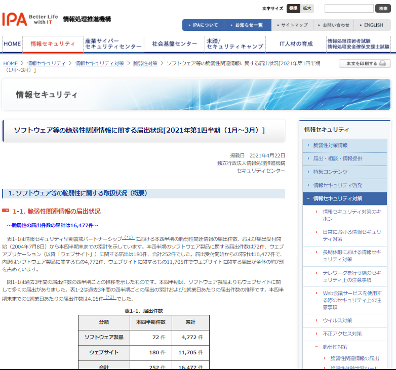

## 概要

- 2021/04/22にIPAからリリースされた `ソフトウェア等の脆弱性関連情報に関る届け出状況[2021念第1四半期(1月-3月)` について中身を確認します。
  - https://www.ipa.go.jp/security/vuln/report/vuln2021q1.html
    - https://www.ipa.go.jp/files/000090367.pdf
- 各項目で脆弱性対応に関係のありそうなものを適当にまとめました。

---

<!-- _class: invert -->

## 事前注意

- グラフや表などは、とくに注釈がない場合は当該資料から引用しています。
  - そのため、図表番号等は飛び飛びとなります
  - あくまで引用なので、詳細を確認したい場合は実際の資料を確認してください。
- 本資料作成者が重要と感じた部分を記載しているだけなので、別の解釈はあり得ます。
  - 必要に応じて、自身で確認/検討してください。
- 本見解は、作成者個人の見解であり、所属組織とは無関係です。

---

## 1. ソフトウェア等の脆弱性に関する取り扱い状況（概要）

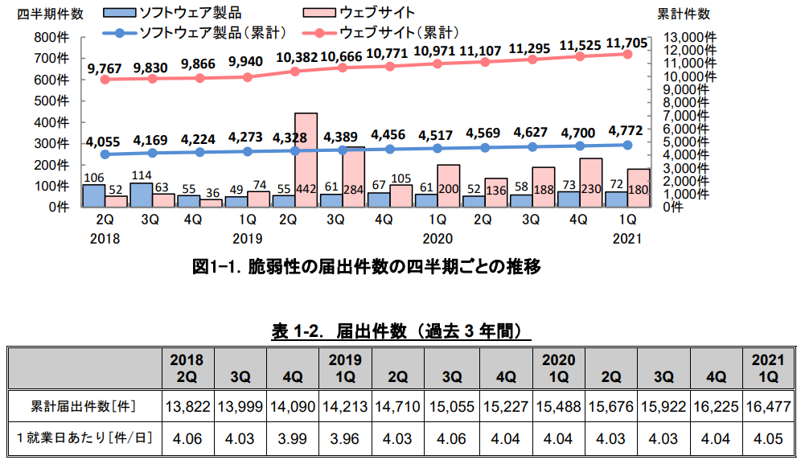

- 想像通り、日々脆弱性の届け出が発生している。
- [1就業日辺り]の届け出数は`4.0n`付近で推移している。
  - 迅速な処理は大変と思われる
- 届け出受理からJVN公表までの日数が45日以内のものは18%だった。
- WEBサイトの脆弱性で、通知後90日以内に修正したものは96%だった。

---

## 2. ソフトウェア等の脆弱性に関する取り扱い状況（詳細）

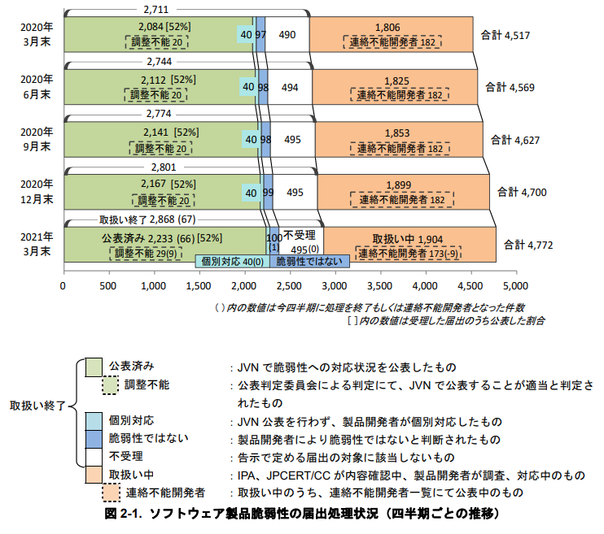
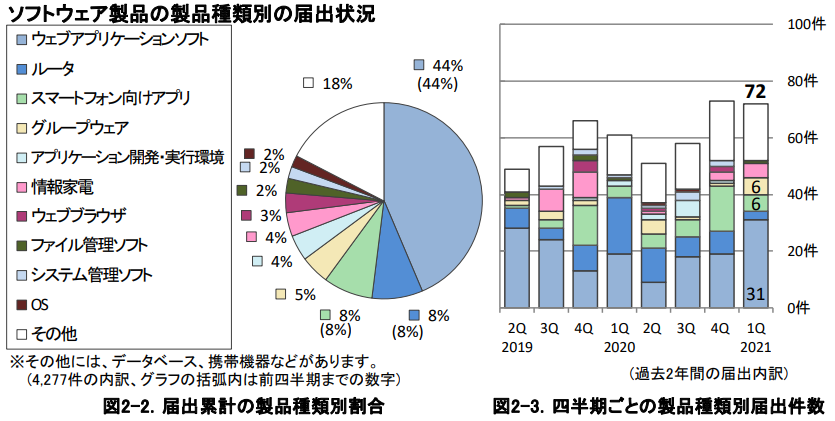
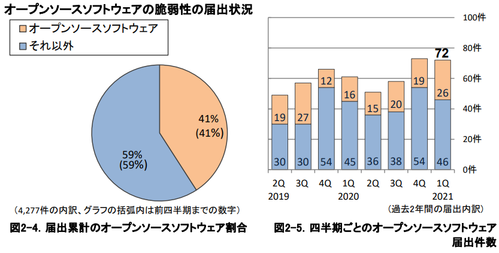

- 累計で見ると、連絡不能開発者は多いかもしれない。
  - ソフトウェアを利用する際には、注意が必要。
- 届出された脆弱性の製品種類では、ルータの脆弱性が、ウェブアプリケーションの次の2位となっている。
  - ソフトウェアだけではなく、ルータ（ネットワーク機器）等のファームウェア更新も重要。
- オープンソースとそれ以外（OSS以外）では、OSS以外の方が届出数は多い。

---

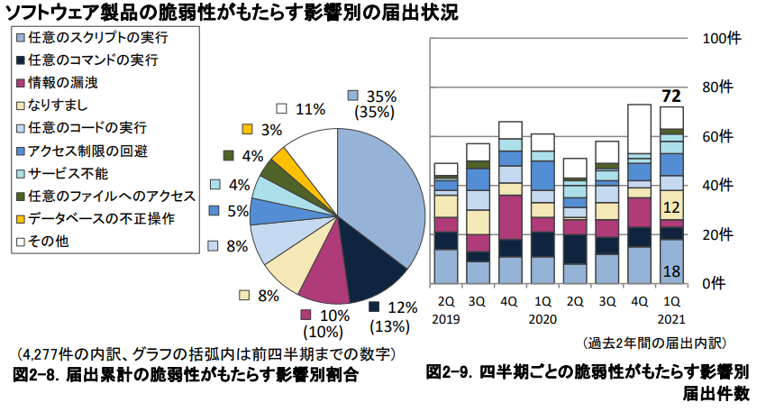
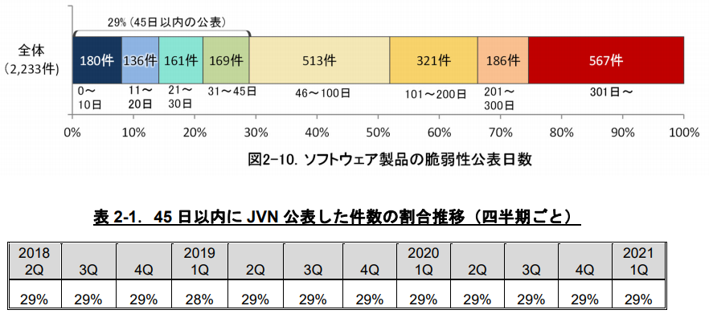
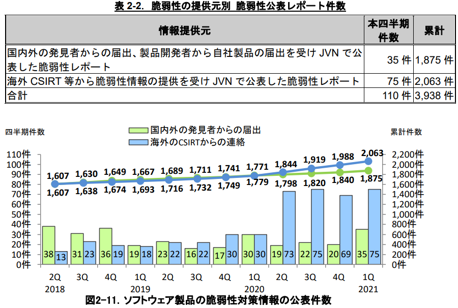

- 影響別の内訳をみると、 `任意の(スクリプト|コマンド|コード)の実行` の合計が55%を占める。
- ソフトウェア製品の脆弱性公表日数（届出受付開始から2021 1Qまで）では、45日以内の公表は29%、100日以内で47%となっている。
- 45日以内にJVNが脆弱性を公表した件数の割合は、ほぼ29%で推移している。
- 海外CSIRT等からの情報によるJVNで公表、が増えている。
  - 制御系製品や医療機器に関する脆弱性情報を、JVNとして注意喚起として公開するようになったため。
  - それだけ問題が出始めているという事

---

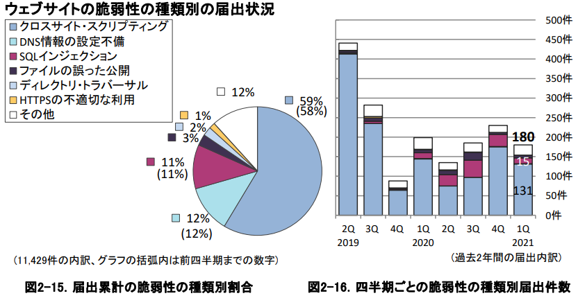
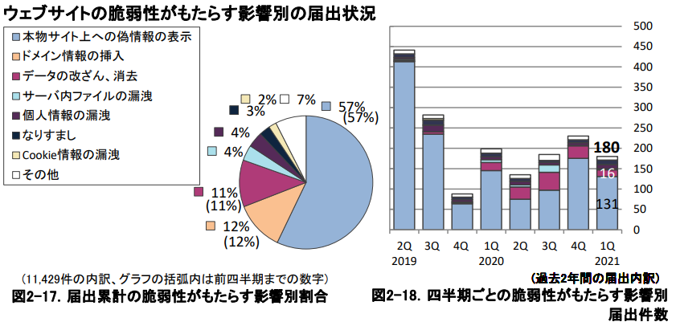
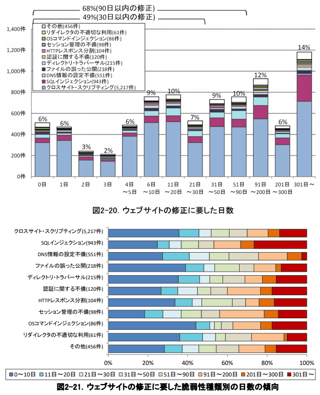

- 届出のあったウェブサイトの脆弱性の種類はXSSが多く、 `本物のサイト上への偽情報の表示` という影響のものが多い
- 種類と影響の状況は一致している
  - XSS：本物サイト上への偽情報表示
  - DNS情報の設定不備：ドメイン情報の挿入
  - SQLインジェクション；データの改ざん、消去
- ウェブサイト脆弱性について、3日程度で修正できたものは18%、10日程度で修正できたのは32%程度。
- OSコマンドインジェクションやファイルの誤った公開は比較的すぐに直せるが、SQLインジェクションやセッション管理不備は対応に時間を要する。

---

## 3. 関係者への要望

- 製品開発者
  - JPCERT/CCの「製品開発者リスト」に登録してください。
  - 自社製人の脆弱性を発見したら、JPCERT/CC若しくはIPAへ連絡してください。
- ウェブサイト運営者
  - 自身が利用しているソフトウェアを把握し、脆弱性対策をしてください。
- 一般のインターネットユーザ
  - パッチ適用などの、自発的なセキュリティ対策を心がけてください。
- 見者
  - 脆弱性が修正されるまでは、第三者に漏れないように適切に管理してください。

---

## 所感

- JPCERT/CCでさえ日々脆弱性が報告されている。CVE採番に至ってはもっと多い。
  - 人力で管理する限界は近い。
- メンテナンスされているソフトウェアを使おう。
  - サポート終了、誰のか分からないソフトウェア、はリスクになる。
- ルータのファームウェアもアップデートしよう。
- Webサイト設計時は、セキュリティを意識した設計をしよう。
  - 後から直すにのは、非常に困難（時間がかかる）
- 制御系や医療系製品の脆弱性対応も、重要です。

以上