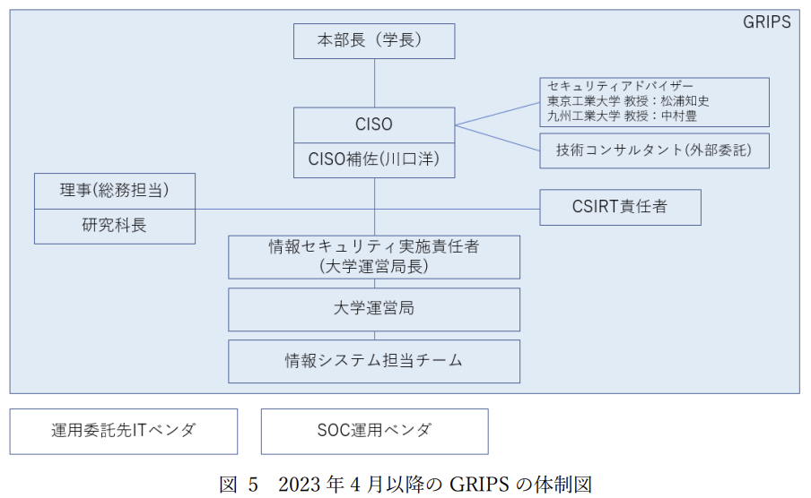
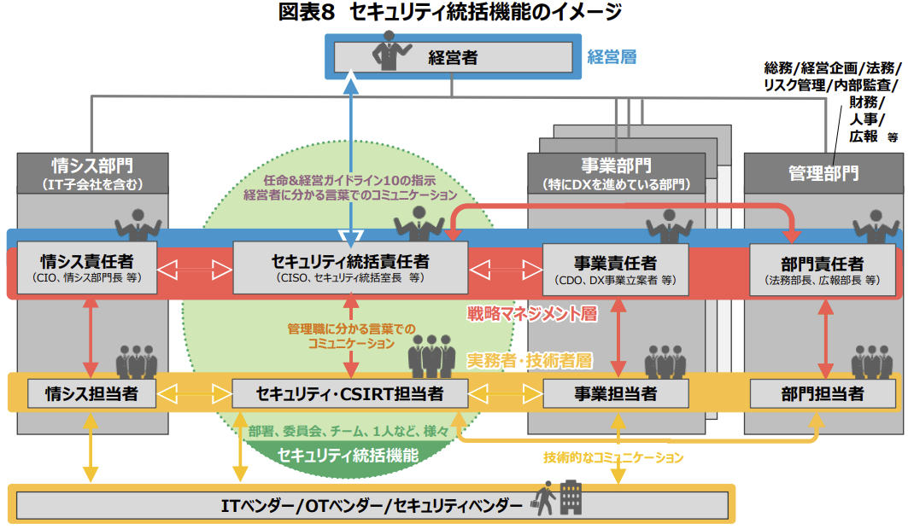
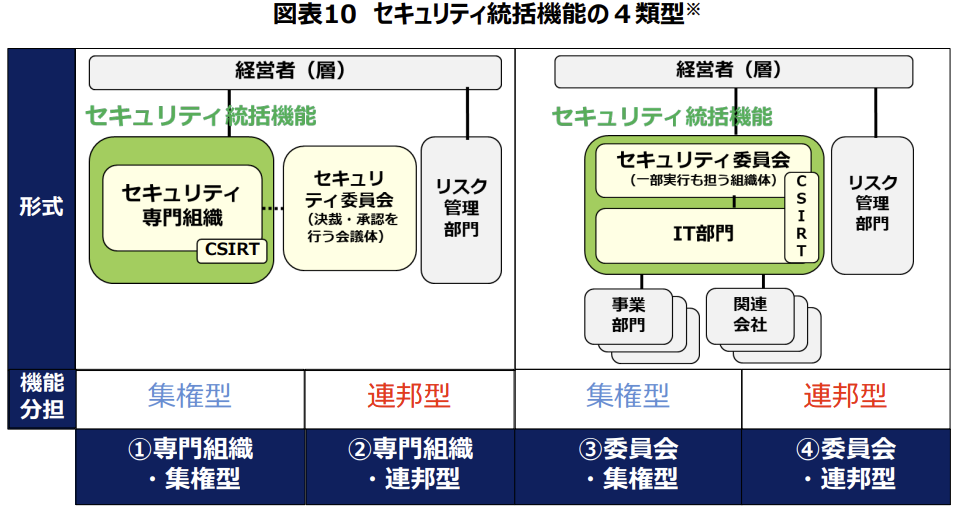
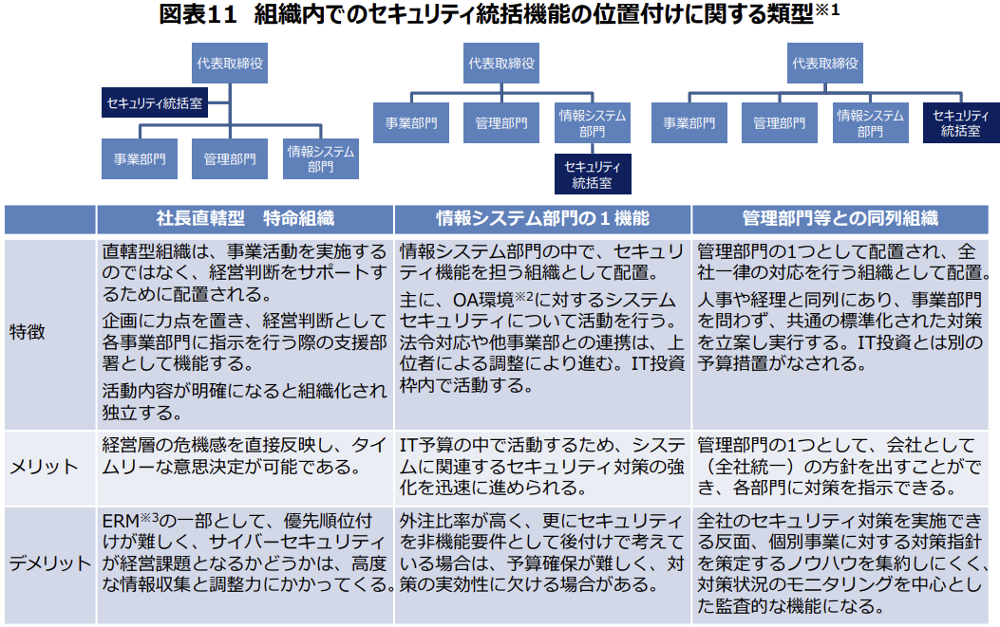
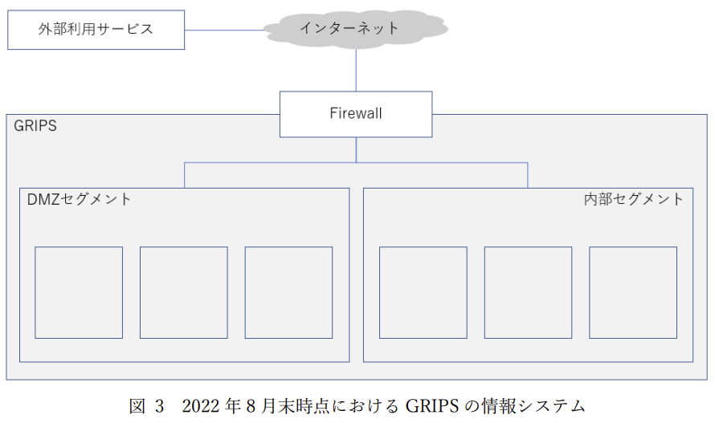
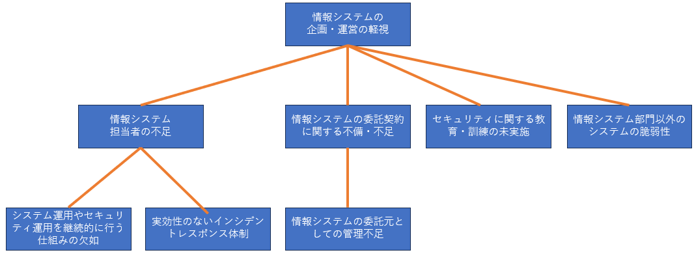

<!-- _class: title-->

# 第12回 脆弱性対応勉強会

## ～政策研究大学院大学のインシデント報告書を読もう～

hogehuga
脆弱性対応研究会
2023/09/02

---

# 説明と諸注意

本勉強会はFacebookグループ「脆弱性対応研究会」主催の勉強会です。
- グループ名が「脆弱性診断研究会」と似ていますが、合意の上でのパクリです

注意事項
- 日本国内において、講義のテクニックを用い、アクセス権のないコンピュータ資源にアクセスした場合、「不正アクセス行為の禁止等に関する法律」の第3条（不正アクセス罪）により、「3年以下の懲役または100万円以下の罰金」に処せられる可能性があります。
- また、他人のIDやパスワードを「正当な理由なく」手に入れた場合、同法第4条（不正取得罪）により、「1年以下の懲役または50万円以下の罰金」に処せられる可能性があります。
- このほか、稼働中のサービスに対して、サービスの停止（可用性を損なう行為）、データの破壊（完全性を損なう行為）、秘密の漏えい（機密性を損なう行為）、ならびに他人の業務や活動を妨げる行為を行った場合、「偽計業務妨害罪」（刑法233条）、「威力業務妨害罪」（刑法234条）、「電子計算機損壊等業務妨害罪」（刑法234条の2）に処せられる可能性があります。
- 上記注意事項は Noriaki HAYASHI 様資料の警告文を、無断引用しています

---

# whoami

```
誰が言ったかではなく、何を言ったか、だ

Jone Doe(-yyyy/mm)
```

# hogehuga (INOUE Kei) a.k.a. HOGE-San

最近JNSAやISOG-Jのお手伝いをすることが多いです。

- JNSAセキュチャレ入門編　副講師
- JNSAセキュチャレ実践編　副講師
- ISOG-J WG6
  - セキュリティ対応組織の教科書(X.1060等)
- InternetWeek 2023登場予定(現時点非公開)

所属会社の意向や発言は、私の主張と同じではない場合があります。逆もあり得ます。
本勉強会は、所属会社とは全く無縁の活動です。

---

# 目次

a. 今回の勉強会の目的と進め方について
b. 各章ごとのまとめ

2. 不正アクセスの概要
3. GRIPSの組織概要と体制
4. 不正アクセス判明後の対応
5. 不正アクセスの被害範囲
6. 情報漏洩に関する調査結果
7. 他機関との連携状況
8. システム復旧に関する方針
9. 被害を発生・拡大させた要因
10. 再発防止のための対策
11. 文部科学省に対する期待
12. 大学のインシデント対応およびシステム復旧に関する評価

---

# 今回の勉強会の目的と進め方

報告書を読んで、疑問点があれば話し合いましょう。

議論例として、私が感じたものを記載しました。これをたたき台に、各章ごとにどうすればよいかを考えましょう。

---

<!-- _class: paragraph -->

調査報告書の読み込み

---

# 2. 不正アクセスの概要

`1.始めに`は省略。

`2. 不正アクセスの概要`部分の記載

- 2015年に、公開WEBサーバに設置されたWebShellが設置された
- 2022/08/28に、突如として内部への侵攻が行われた
- メンテナンス作業中に不審なログを発見し、攻撃が判明
- EDRにより、被害範囲が公開WEBだけではないことが判明し、ネットワーク切断を実施

タイムライン等を確認すると、対応および判断が後手に回っているように思われる。

- 緊急対応処置以降の処置が、「事前に検討してある対応」ではないように見える
  - 他社連携が、打診 -> 実施、の時間が空いている
  - セキュリティアドバイザへの打合せ打診/実施、の時間も空いている

体制を含む、事前準備について知見が得られると考える。

---

# 3. GRIPSの組織概要と体制

- 組織の人員
  - 教員 67人、職員 122人(2023/05/01時点)
  - 情報システム担当者 1人(2022/08時点)
    - 外部委託しているITベンダーと契約及び管理を行う
    - 総務部門兼任であり、情シス担当としての実質稼働は、0.5人
- 外部連携
  - 委託先ITベンダは1社で担当
    - システムの種類や業務ごとに担当チームがある
    - 強力会社であるITベンダ複数社と共に運用する体制
  - セキュリティアドバイザーとして、大学教員にセキュリティ全般に関するアドバイスを受ける体制
- ネットワーク
  - インターネットとは、Firewall(UTM?)を通じて、DMZ及び内部セグメントに分かれている

---



# ディスカッション(体制)

レポートラインや権限を考慮する必要があると考える。

- セキュリティアドバイザーは、この位置でよいのか
  - 本来、誰と密に連絡を取り合うべきなのか
  - 情報システム担当が相談できる環境か
- CSIRT責任者は、この位置でよいのか
  - 理事（総務担当）や研究科長と同列でよいのか
  - CSIRT責任者と情報システム担当の関係はこれでよいのか
  - CISOとの位置関係はこれでよいのか
- CISOは、この位置でよいのか
  - 大学運営局と並列でよいのか
  - CSIRT責任者と並列でよいのか


---

# 参考

サイバーセキュリティ経営ガイドラインが参考になると考えられる
- 「サイバーセキュリティ経営ガイドライン Ver2.0 付録 F サイバーセキュリティ体制構 築・人材確保の手引き 第２版」
- https://www.meti.go.jp/policy/netsecurity/mng_guide.html

  

---
# .

インシデントの結果を基に今後を考察するのであり、当時が問題だったという話ではない点に留意。

<!-- _class: centre-->

 

---



# ディスカッション(ネットワーク)

この構成自体は、問題があるのだろうか

- 構成自体の問題
  - セグメントの設計、等
- 構成要素自体の問題
  - Firewallの設定、等

要件
- 学内向け
  - 教員用PC, 電子メール, 図書館システム, ファイル共システム, 学内ネットワーク接続, 契約機材の運用保守
- 学外向け
  - 公開情報掲示WEB, SSOサービス, DNSサービス

(機能とセグメントの説明が一部不明な気がする？)

---

# 4. 不正アクセス判明後の対応

タイムラインから

1. 公開WEBにweb shell設置
2. SSOサーバへのログイン成功、内部ネットワークスキャン
3. ファイルサーバ1のSSHログイン成功、バックドア設置
4. ADサーバ2へのSMBログイン成功
5. Proxyサーバ1/2へのSSHログイン成功、バックドア設置
6. ADサーバ1へのSMBログイン成功、調査用ツール作成と実行
7. LDAPサーバへのSMBログイン成功
8. 死活監視サーバへのRDPログイン成功
9. ファイルサーバ2へのSMBログイン成功
10. 職員端末へのSMBログイン成功、バックドア作成
11. ファイルサーバ3へのSMBログイン成功

---
# .

何故ログインがことごとく成功したのか
- ActiveDirectoryは、アップデート未実施による脆弱性の可能性もある？
- ActiveDirectory周りでの資格情報盗難だけでは、SSHログインまではできないのでは
  - 棚卸しない為、不適切なアカウントやパスワード設定不備？

---

# 5. 不正アクセスの被害範囲

範囲特定は、ログ等により絞り込めている

- 公開WEB
  - 2015/04からのアクセスが追跡できている
- 被害ホスト
  - ログイン成功が記録されており、時期が特定できている
  - EDRのアラートにより、攻撃有無が特定できている

公開WEBの`ログで2015/04にwebshellが設置されたことを確認できた`のは重要と思われる。

- やはりログは偉大
  - 保存期間はどうあるべきなのか
    - 定期検査などの、他の運用状況により保管期間は変えてもよいかもしれない
  - 今回はたまたま異常を認識できた？
    - 定期的なログの検査が必要、その為の人員（工数）も必要
- 被害範囲により、個人情報保護委員会への報告が必要
  - どの時点で判断ができるか/判断するべきか

---

# 6. 情報漏洩に関する調査結果

ログ保管の重要性が際立つ、と考えられる

- ログ調査での痕跡追跡
  - ログイン履歴、`不正な通信`の履歴
    - 不正な通信 is 何？(Firewall的denyだけではなく、UTM機能としてか)
- アクセスに対する意図的な監査はされていなかったと思われる
  - ログインや不正な通信、EDRが検出しなければ侵害されていないという前提
    - ファイルアクセスログまであったのか、必要なのか、保存期間は、という問題がある
- 個人情報保護委員会への方向的観点
  - 端末が侵害された場合、端末内に個人情報が存在した可能性があるとして、漏洩の可能性ありとして取り扱事がある
    - ランサムウェア感染で、端末感染内に何らかの顧客情報がある可能性があり、即時に通報する運用もある

---

# .

- インシデント時の対応速度が遅い問題
  - フォレンジック調査を打診(1日後) - 依頼(10日後)
    - システム停止等で固定されていれば時間がかかっても許容できるのか
    - インシデント時を想定した対応速度の契約は可能なのか

---

# 7. 他機関との連携状況

実施内容

- 文部科学省
  - 通知に基づいた、不正アクセス対応と発生事実及び体制の構築について報告
    - 対応主体は学校であり、報告先として機能しているようだ
  - 類似被害防止の為、不正プログラムやベンダの調査結果も共有
- 個人情報保護委員会
  - 報告を 52日後 に実施
    - どのタイミングで報告すべきなのか
- 警察
  - 報告を 23日後 に実施
    - どのタイミングで報告すべきなのか

---

# 8. システム復旧に関する方針

不正アクセスを受けたサーバは、システム再構築及び廃止とした

- 公開ウェブサーバ
  - 廃止、同様の機能提供については今後検討予定
- その他
  - システム構築時のバックアップデータを利用し再構築
  - データは、複数のウイルス対策ソフトでスキャンした後に移行
  - 職員端末は、新規端末配布

不正アクセスの兆候が発見されなかったシステム
- 共通対策を実施し、継続使用
  - アップデート、アカウント棚卸
  - EDR導入、脆弱性診断ツールによるスキャン
  - 接続できるIPの制限

---

# 9. 被害を発生・拡大させた要因



- 軽視は、執行部の責任は重い
  - システム的対策はした=お金を払えば対応できるから?
  - 組織的対応は実施されていない=軽視?分からないから?
    - 文科省提出工程表には記載があるので、軽視か -> 教育不足
- 担当者不足は、何故1人割当(実質0.5)なのか、軽視したからか
- 委託には具体的な項目が記載されておらず、善意に期待するものとなっていた
  - 善意ベースは、発注者も委託先もモンスターになり得る恐れ

---
# .

- システム運用は、ベンダ常駐に依存
  - 監督するための能力の欠如により、対応に長い時間がかかった
    - 監督を実行するための能力を高めれば済む話か
  - ベンダが、既定されていた運用項目を一部実施せず
    - 委託の具体的な項目に含まれていた？(月次セキュリティチェック等)
- 実効性のないCSIRT
  - 知見を持たない人員での、メンバー任命 -> 教育、担当者不足
- 教育の欠如
  - 執行部に対する教育の必要性（サイバーセキュリティ経営ガイドライ等も利用できる?）
  - 情報システム担当者に対する教育
    - 教育を行えるものが居ない為、自主努力に依存
    - セミナや研修に参加する余裕がない -> 担当者不足
- 情報システム部以外の、個別に導入したシステム
  - 全体統制を取れる体制が必要

---

# .

- アカウント管理
  - 棚卸ができていない、事前の対応手順作成等が不足している
- 資産管理
  - 可視化の仕組みが無い、自動化が望まれる
- 脆弱性管理
  - NISC注意喚起に依存し過ぎている -> 担当者不足、自動化、資産管理
- マルウェアを含んだままのコンテンツ移行
  - 移行時は、精査や再構成で、過去をリセットするような対応が良いのかも
- ログ
  - 運用観点で参照されていたが、セキュリティ観点での分析体制が未整備
    - 人員不足、知見不足 -> 対策軽視
    - 集約の重要性
- 導入機器を生かし切れていない
  - 高機能ファイアウォールを使えていない -> ベンダ側が提案すべき？善意？ -> 発注者の能力不足

---

# 10. 再発防止のための対策

- 組織的な対策
  - 体制強化
    - セキュリティ等を熟知した人物を「学内に配置するのが望ましい」
      - 無理：アドバイザー強化、CISO補佐任命、サポート用にコンサル契約
      - 発生時に即時に相談/対応できる人物を確保したい
    - 情報システム担当者の増員(4名体制)
    - 「文部科学省に対しての報告」という体裁が多い？
      - 文科省側も対応が必要になる？
- 技術的対策
  - 「文部科学省や JPCERT/CC が提供する情報をソースとして分析フローを構築し、大学に対する不正アクセスの発見に努めることが重要である」
    - そうなの？分析フロー構築は、個々の学校で開発するのは難しい。 -> 外部委託SOC等？
  - 見直しでログ保管1年となったが、今回の7年前のログのようなものはなくなるのはどう考えるのか
    - 検出環境ができているなら、見逃しが無い前提で期間を短くするのはア

---

# .

 

---

# 11. 文部科学省に対する期待

- インシデント発生時のフォローアップ
  - 自助と言いつつ、異動による引継ぎ欠落を文科省に確認させることを想定している？
- 小規模/文系に対する支援強化
  - 適切な体制整備への指導
- 訓練や演習
  - 学校向けセキュリティ訓練/演習促進期待
    - CYDER等との連携、文科省個別での定期演習プログラム -> 人員不足解消が先？

---

# 12. 大学のインシデント対応およびシステム復旧に関する評価

- 大学の自助努力のみに頼るのも限界がある
- 利用可能な予算は減少し続けている
- 大学自身はもちろんの事、文部科学省はじめ政府機関も一体となって状況の改善に努めるべき

大学の自助/自治を前提として、監督省庁等はどこまで踏み込むのが良さそうなのか
- インシデント時のアクション
  - アドバイザー派遣
  - 運営主体が学校である以上、サポートや規定による縛りでの対応？
- 平時の備え
  - 執行部への教育
    - 学校"経営"という観点で、サイバーセキュリティ経営ガイドライン
  - 情報システム担当者への教育
    - 教育ができる環境を促す -> 人員不足対策
    - 知識を得るための場の用意(案内)？


---

<!-- _class: paragraph -->

終わりに

---
# .

良かったこと
- ログが残っていた
- 緊急対応措置の判断を比較的早く行えた
- バックアップストレージをネットワークから遮断できた
- 発生時点の状況でのベストを尽くせた？（モバイルルータで事業継続等）

残念だったこと
- 執行部のセキュリティ軽視
  - 本件の前のインシデントでも、きちんと対策が取られていなかった
- ログは取ってたけど、分析する仕組みはなかった？
- 関係各所への報告判断が遅い？
- インシデント時に対応できる体制ではなかった
  - ベンダに調査打診と依頼のタイムラグ、等
- 不慣れすぎた、、


---

# まとめ

過去で発生したことを後知恵で責めても意味がありません。

未来に向けアクションとしてどうするべきか、を公開された事例から考えていければよいなと思います。

そういえば疑問点が

- JPCERT/CCに報告し、レスポンス対応をサポートしてもらう必要があったのか
  - 中小企業に対しては、何らかの施策を出している（お助け隊？）
  - NISC事件の際は、何故JPCERT/CCに話をしないのかとキレてたが、本件はどう思うのか
    - インシデント対応も情報開示も必要で、JPCERT/CCと連携すると知見は生かせたたかもしれない
- 文部科学省の施策や方針が、一般的には良く分からなそう
  - 報告書では「大学等におけるサイバーセキュリティ対策等の継続的な取り組みについて（通知）」位しかかかわりが分からない
  - 学校の自治とか独立性を考えると、中小企業とは違う扱いなので難しそう
  - 医療系で見られる問題と同じようにも考えられる(お金が無く対策ができない、等)