<!-- _class: title-->

# 脆弱性対応勉強会VR 第02回
## EPSSについて理解しよう


2024-09-21
hogehuga

----

# 説明と諸注意

本勉強会はConnpass上でイベントを行っている「脆弱性対応研究会」主催の勉強会です。
- Connpassでイベント告知、Facebookでグループとしての体裁保持、をしています

## 注意事項(毎回掲示)

- 日 本国内において、講義のテクニックを用い、アクセス権のないコンピュータ資源にアクセスした場合、「不正アクセス行為の禁止等に関する法律」の第3条（不正アクセス罪）により、「3年以下の懲役または100万円以下の罰金」に処せられる可能性があります。
- また、他人のIDやパスワードを「正当な理由なく」手に入れた場合、同法第4条（不正取得罪）により、「1年以下の懲役または50万円以下の罰金」に処せられる可能性があります。
- このほか、稼働中のサービスに対して、サービスの停止（可用性を損なう行為）、データの破壊（完全性を損なう行為）、秘密の漏えい（機密性を損なう行為）、ならびに他人の業務や活動を妨げる行為を行った場合、「偽計業務妨害罪」（刑法233条）、「威力業務妨害罪」（刑法234条）、「電子計算機損壊等業務妨害罪」（刑法234条の2）に処せられる可能性があります。


---

# whoami

hogehuga a.k.a. HOGE-San
- Work
  - 脆弱性管理等について研究開発を行い、イベント発表等で社内外へ還元する
- 発表歴
  - InternetWeek 2023/InternetWeek Showcase in 福岡
  - NCA Annual Conference 2023
  - Hardening Desingers Conference 2024　他
- 社外活動
  - ISOG-J WG1 "脆弱性トリアージガイドライン作成の手引き"
  - ISOG-J WG6 "セキュリティ対応組織の教科書"
  - NCA 脆弱性管理WG　他

**所属会社の意向や発言は、私の主張と同じではない場合があります。逆もあり得ます。
本勉強会は、所属会社とは全く無縁の活動です。**

---

# 今回の概要と目次

EPSSについて、以前より認知が広まってきているようなので、現時点の(私が)認識している状況を共有します。
概要を再確認し、簡単な使い方と、どのように活用していくのがよさそうかをお話しします。

- 想定ゴール
  - EPSSの概要を理解する
  - 必要ならば、APIで値を取って確認ができるようになる
  - 実運用に組み込む際の検討すべき点を認知する
  - EPSSについてはとりあえずこれを読めばよい、な資料とする


# 目次

1. EPSSを理解する
2. EPSSを使ってみる
3. EPSSを活用する

---

<!-- _class: paragraph -->

1: EPSSを理解する

---

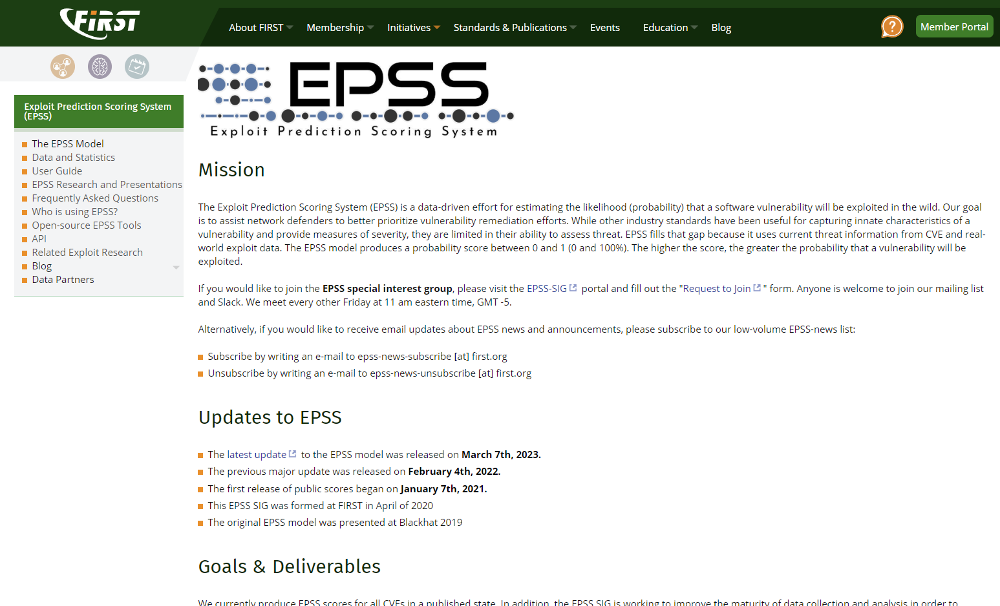

# 概要説明

EPSS: Exploit Prediction Scoreing System(Exploit予測スコアリングシステム)
- [https://first.ofg/epss](htts://first.org/epss)
- ソフトウェアの脆弱性が、実際に悪用される可能性（確率）を推定するための取り組み
  - 複数のオープンデータセットと商用データセットを取込んでいる
    - IDS/ハニーポット/ネットワーク観測/マルウェア解析と検出/ネットワークセンサー etc
  - 可能性の推定であり、**アクティブな悪用の証拠が他にない場合にEPSSを使用するのが最適**
    - KEV Catalog等があればそちらを優先する
- FIRSTが主導して進めている
  - 2021-01-07 に提供開始
  - EPSSモデルのアップデートが時々行われる(2022-02-04,2023-03-07)

---

# 脆弱性情報の取り扱い

https://www.first.org/epss/model

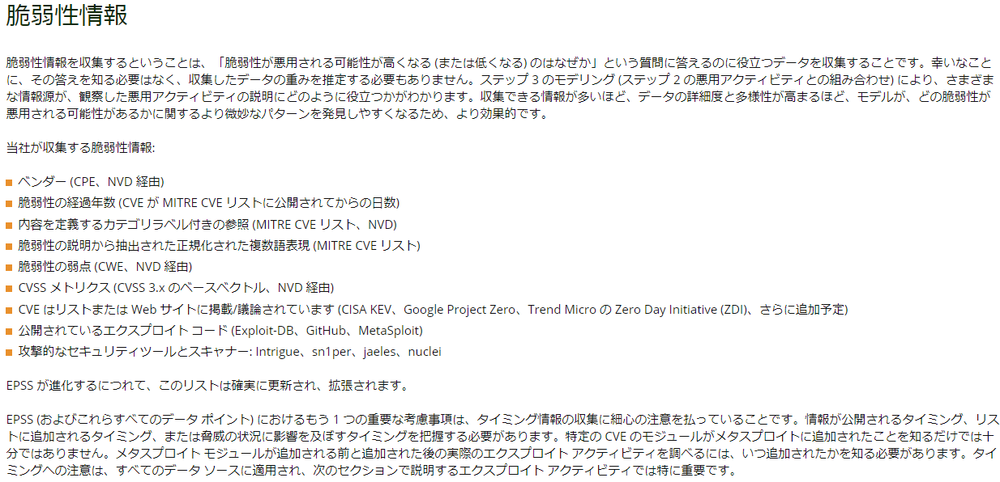

---

# 提供されるデータ

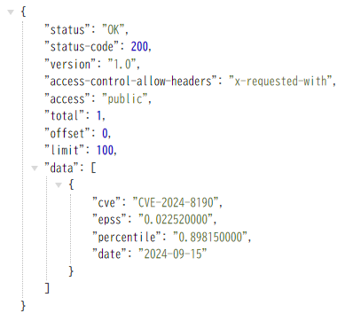

以下のデータが、CVE-ID毎に提供される
[https://www.first.org/epss/articles/prob_percentile_bins](https://www.first.org/epss/articles/prob_percentile_bins)

- **epss**
  - 今後30に置換の悪用確率（0-1）を示す、EPSSスコア や EPSS Probabilityと呼ばれるもの
- **perentile**
  - 現在のスコアのパーセンタイル、スコアがつけられたすべての脆弱性のうち EPSSスコアが同じかそれより低い物の割合

APIで単一CVE-IDにアクセスすると、右記のようになる（詳細後述）

---

## EPSS Score(Probability)

0から1までの数値で示される、今後30日以内に悪用される確率
- 明らかに大半の脆弱性は25%未満、10%未満といえる
  - 脆弱性の約5%のみが実際に悪用されている
- 悪用に関する「世界的な」尺度を示している

```
Clearly, the vast majority of vulnerabilities score below 25%, and even below 10%.
This reflects a global measure of vulnerability exploitation in the wild. Indeed, only around 5% of all vulnerabilities are ever exploited in the wild (see references at the end of this article).
```

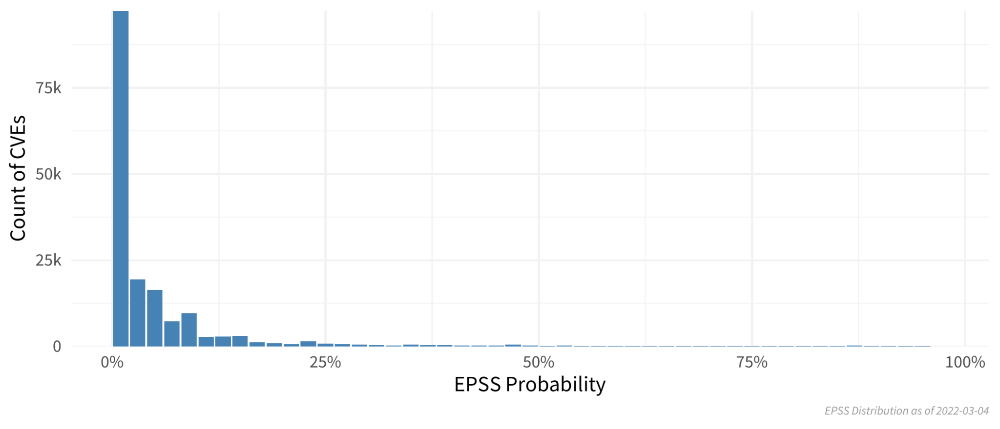

---

## (2024-09-08の例)

当該日分として、258,623個のCVE-IDが登録されている

- 想定される分布になっている
- 0.8から1.0にかけて、ほんの少しだが微増するようだ

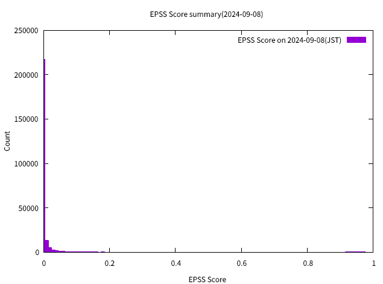 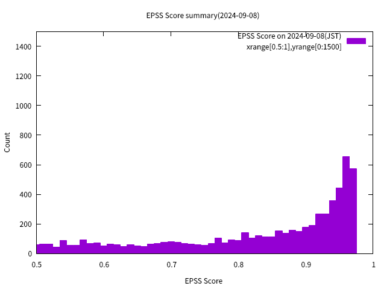

---

## EPSS Percentile

EPSSの値の違いを相対的に比較する際に有効
- "パーセンタイルは、現在の順位以下のすべての値の割合です"
  - `That is, the percentile is the proportion of all values less than or equal to the current rank.`
  - 簡潔に言えばランクであり、EPSSが同値の物が全体のどれだけあるかを示す
  - `100 - Percentile` することで、上位 N%の物 といういい方もできる


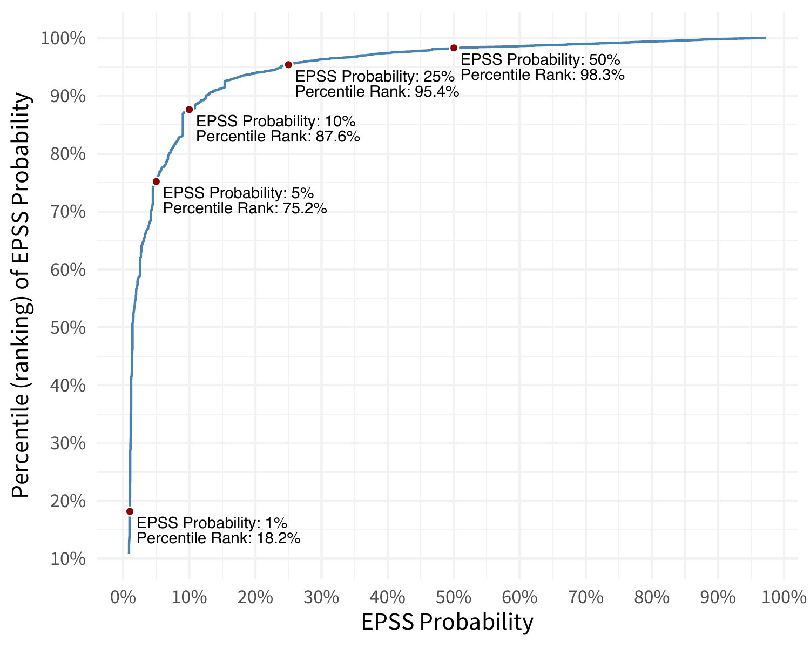

---

## (2024-09-08の例)

FIRSTの資料より、EPSS低スコアの物が増えたようで、グラフの角度が急になっている
- EPSS Score 0.03(3.0%)程度で、Probabilityが0.9になっている
  - EPSS 0.05が、Probability 0.93025

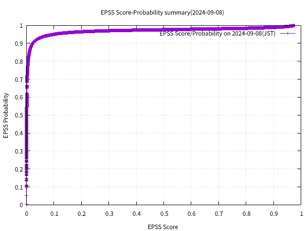  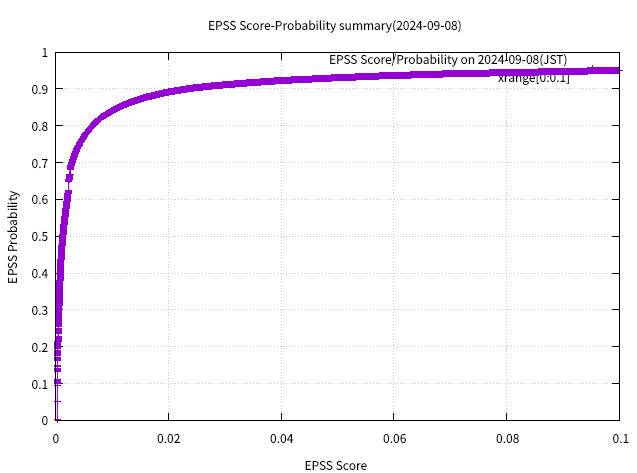

---

## (再掲)

 

---

<!-- _class: paragraph -->
2: EPSSを使ってみる

---

# データの取得方法

FIRSTのサイトから、以下の2種類の方法で取得する
[https://www.first.org/epss/api](https://www.first.org/epss/api)

- APIアクセス
  - `https://api.first.org/data/v1/...` とアクセスを行う
- CSVダウンロード
  - `https://epss.cyentia.com/epss_scores-YYYY-MM-DD.csv.gz` として、特定日のCVE-ID全ての情報をダウンロードする

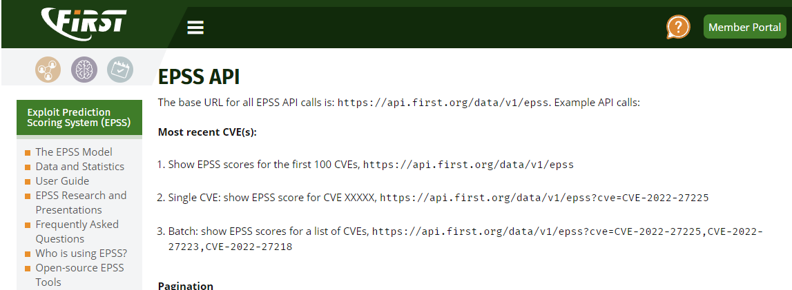

EPSSを理解をするために、APIアクセスで実際にデータを触ってみる

---

# データを使ってみる(1)

最新のEPSSデータのみを取得する
- 単一CVE-IDの場合
  - `https://api.first.org/data/v1/epss?cve=CVE-2022-27225`
- 複数CVE-IDの場合
  - `https://api.first.org/data/v1/epss?cve=CVE-2022-27225,CVE-2022-27223,CVE-2022-27218`
- 日付を指定する
  - `https://api.first.org/data/v1/epss?cve=CVE-2022-26332&date=2022-03-05`

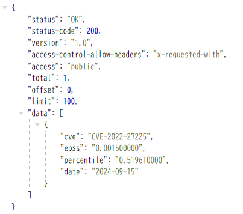 
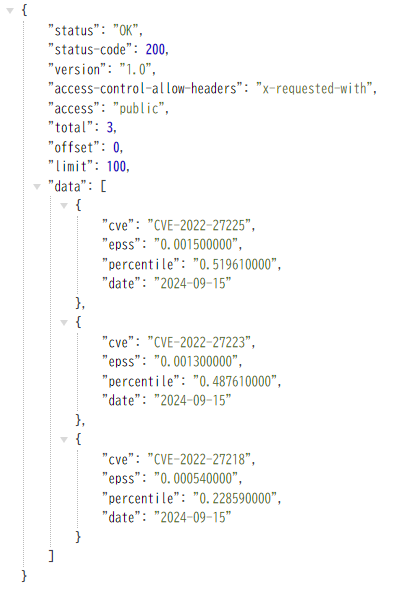

---

# データを使ってみる(2)

時系列のデータを取得する
- `https://api.first.org/data/v1/epss?cve=CVE-2022-25204&scope=time-series`

EPSSのデータで絞り込む
- TOP 100 
  - `https://api.first.org/data/v1/epss?order=!epss`
- EPSS Score
  - `https://api.first.org/data/v1/epss?epss-gt=0.95`
- EPSS Percentile
  - `https://api.first.org/data/v1/epss?percentile-gt=0.95`

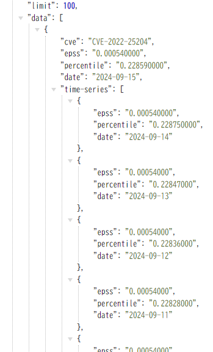

---

## handson

以下、実際にアクセスして試してみる

- **Q:** CVE-2024-8190 `Ivanti Cloud Services Appliance OS Command Injection Vulnerability` の最新のEPSS/Percentileを確認する
  - **A:** `https://api.first.org/data/v1/epss?cve=CVE-2024-8190`
- **Q:** 上記脆弱性の直近の水位はどうなっているかを確認する
  - **A:** `https://api.first.org/data/v1/epss?cve=CVE-2024-8190&scope=time-series`
- **Q:** EPSS Scoreが0.97以上の脆弱性は何個あるのか
  - **A:** `https://api.first.org/data/v1/epss?epss-gt=0.97` の応答に `"total": 572,` とある

---

# その他のデータ取得

- [hogehuga/threatWatchDog](https://github.com/hogehuga/threatWatchDog)
  - 前日とのEPSS値の比較を行い、変化量を見るツール
  - 突然EPSSが増加した場合、何らかのExploitが公開された/悪用が観測された 可能性がある
  - 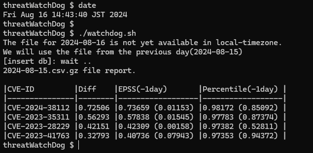
- [hogehuga/epss-db](https://github.com/hogehuga/epss-db)
  - EPSSデータをすべてmysqlに保管し、SQL分で頑張れるプロジェクト
    - 過去のEPSSデータを保管するため、データ量は多くなるが、時系列での確認が可能
    - KEV Catalogも同様に取り込める(最新盤のみ)

---

<!-- _class: paragraph -->

3: EPSSを活用方法する

---

# どのようにEPSSを使えばいいのか

EPSSは、あくまで「今後30日間での悪用される確率」であり、目安である。

- KEV Catalogのように、「既知の悪用された情報」があれば、そちらを優先すべき
  - NISTやJPCERT/CC等が警戒情報を出しているのでそれを活用する方が、先にやるべき事
- 悪用の確率は、「脆弱性それ自体の危険度」を示してはいない
  - `リスク = 脆弱性 x 機会 x 資産価値`　の観点で、1つの指標でしかない
    - リスクの表現は、上記以外にもいろいろな表現はあるので、ここではこれを使う
  - 恐らく、`悪用されても影響の少ない脆弱性` の悪用される確率を見るのは、あまり意味がない
    - 故に、それを示すCVSSをベースとし、追加情報としてEPSSを使うのが良い
    - なお、資産価値（システムの価値）は日ごとに変動するものではないので、システムでは一定として扱うことが多い
- 値の変動はそれなりに存在する
  - 減少する場合もあり、その場合はどうするか(通常、無視する)等を検討する必要がある
  - 監視するなら、ディスク使用率監視のような`絶対値`と`増加量`での監視を検討しても良いと思われる

これらを踏まえ、EPSSの対応ポリシーを考えたほうがよいと思われる。

---

## EPSS取り扱いのポリシーを決める

組織の運用成熟度と併せて検討する。
基本的に、やるべきことや目標を決め、それに合わせて手段やツールを選択することが重要。

- EPSSを使うために使う、でなはく、必要となった状況なら使う、が良いと考える

例
- まだ何もやれていない組織
  - EPSSはまだ不要
    - 先に、脆弱性対応を行う組織運用を
- 自組織でオープンな情報も参照しつつ、判断している
  - CVSSだけ（BaseScoreやVector）は使っている組織
  - ここには有効かもしれない。追加の情報として扱う。
- ベンダ独自指標を使っている組織
  - ベンダ独自指標に同等の情報が含まれている可能性が高く、それほど意識する必要はない可能性

---

# hint: ポリシー(1)

脆弱性管理（トリアージ部分）の成熟度案

1. 何もしてない
2. まずは、KEV Catalogに載ったもの、JPCERT/CCの警戒情報を基に対処する組織組成（受け身の対応）
3. セキュリティ情報を得るようにする、保有資産（ソフトウェア等）を明らかにしていく（能動的対応）
   1. ネットニュースなど
   2. JPCERT/CC等の、週次の脆弱性情報まとめ送りの活用
   3. NVD等の脆弱性情報を活用
4. 脆弱性トリアージを行う
   1. CVSS BaseScoreを使う
   2. CVSS Vecotrを考慮する
   3. KEV Catalogを考慮する
   4. Exploit情報を考慮する
   5. EPSSを考慮する、等

---

# hint: ポリシー(2)

EPSSは増加するだけではない為、各種の状況に対してどのように受け止めるかを決めておいた方が良い
- EPSSの差分値
  - 急増した場合
    - Exploitや悪用が観測されたと考えられる。KEV Catalogとも連動している。
  - 急減した
    - 原因は不明ながら、減少する場合がある。相対的なものなのか、減少幅などを見て考える必要がある。
    - 例えば、0.80から0.55程度に減少した場合、どう扱うべきなのか
- EPSSスコア
  - 何をもってEPSSの情報を活用するのか
    - 特定数値以上であれば対応する、急増したものは念のため確認する、減少については特に対応しない、etc

EPSS ScoreとProbabilityにおいて、どのような状況が発生し、どのような解釈をするのかを、事前にある程度決めておく必要がある。そして、EPSS単体で使わないのが解決策になる事が多い。

---

# hint: 気にしておくこと

- 値を信じすぎない事
  - あくまで、可能性、の数値
    - この値での判断を独り歩きさせない
  - その可能性をどう考えるか/扱うかは、あなた次第
    - だからポリシー作ろう
    - 数値の増減で一喜一憂しない
    - 別の指標と組み合わせよう
      - KEVやExploit情報と併せよう
- EPSSは、既存の脆弱性管理の脆弱性トリアージに追加する程度がよさそう
  - まずは脆弱性管理ができている状態を作る
  - CVSS Vector値やKEV Catalogの補完として使う
    - ある程度脆弱性管理ができており、脆弱性トリアージで更に絞込みをしたい組織に有効

---

# hint: EPSSとKEV Catalogをどうとらえるか(案)

- 意図が異なる
  - KEV Catalog
    - **既に**悪用が確認されている脆弱性の一覧
  - EPSS
    - 今後30日以内に悪用される**確率**
- どう考えたほうが良いか
  - 確率よりも、既に悪用が確認されているものを優先して対応すべきでは
    - KEV Catalogを基に対応し、それ以上対応できそうならEPSSを見る
  - リスクを基に対応を考える
    - EPSSは、CVSSと組み合わせることで「リスク=**脆弱性**x**機会**x価値」迄見ることができる
  - ということは？
    - KEVを使う -> CVSS+EPSSを使う、の順がよさそう

---

# 想定される利用例

ポリシーを決める
- 対応をどうするか
  - EPSSによって、どのような対応をするか
  - EPSSがどのような状況になったときに、どのような対応をするか
- アラートのための閾値をどうするか
  - 変化量監視やEPSS Score監視をする場合の、閾値決定

運用に組み込む（組織の状態によりいづれかを選ぶ）
1. EPSSは利用せず、KEV CatalogやJPCERT/CCの注意喚起などを用いて対応する
2. EPSSに閾値を仮定し、閾値を超えたものを解釈する
3. EPSS増加量に閾値を仮定し、閾値を超えたものを解釈する
4. EPSSの値/増加量の値 錦地位を仮定し、閾値を超えたものを解釈する
5. 他の脆弱性優先度指標に、追加的に使う

---

# まとめ

EPSSについておおよそ理解ができたと思います。
- 30日以内に悪用される**確率**
  - 悪用の証拠があれば、それを優先してみるべき=KEV Catalog
- ScoreとPercentileがある
  - EPSS Scoreは、0-1の確率で、大半が0.25以下に収まっている
  - EPSS percentileは、EPSS全体での位置を示す目安になる

どうやって使えばいいか、もおおよそ目途が付いたかと思います。
- 脆弱性トリアージの追加情報として使える
  - まだやっていない場合は、KEV Catalog等から始める
  - CVSSでのトリアージで限界を感じてきた場合には、追加情報としてあると有用
- 無理に使う必要はない

---

# Appendix

- FIRST: EPSS
  - https://www.first.org/epss/
- CISA Known Exploited Vulnerability Catalog
  - https://www.cisa.gov/known-exploited-vulnerabilities-catalog
- CISA: Known Exploited Vulnerabilities Catalog
  - https://www.cisa.gov/known-exploited-vulnerabilities-catalog
- ISOG-J WG1 "脆弱性トリアージガイドライン作成の手引き"
  - https://isog-j.org/output/2024/TriageGuidelines.html
- 脆弱性対応勉強会（当勉強会）
  - https://zeijyakuseitaioukenkyukai.connpass.com/ (イベント)
  - https://www.facebook.com/groups/zeijyakuseitaioukenkyukai (コミュニティ的な)
  - https://www.youtube.com/@vulnstudy (動画)
  - https://github.com/hogehuga/vulnRespStudyGroup/ (資料置き場)

---

# Appendix(2)

- FIRST: CVSS
  - https://www.first.org/cvss/
- SSVC
  - CISA
    - https://www.cisa.gov/stakeholder-specific-vulnerability-categorization-ssvc
  - Carnegie Mellon University
    - https://insights.sei.cmu.edu/library/prioritizing-vulnerability-response-a-stakeholder-specific-vulnerability-categorization-version-20/
- ISOG-J WG6 "セキュリティ対応組織の教科書"
  - https://isog-j.org/output/2023/Textbook_soc-csirt_v3.html
- METI: サイバーセキュリティ経営ガイドラインと支援ツール
  - https://www.meti.go.jp/policy/netsecurity/mng_guide.html